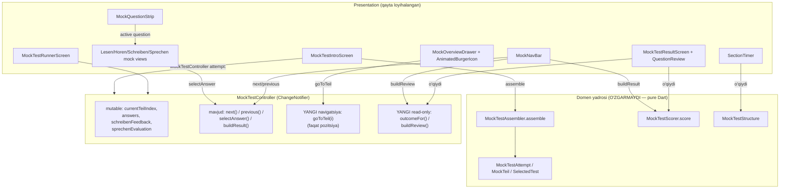
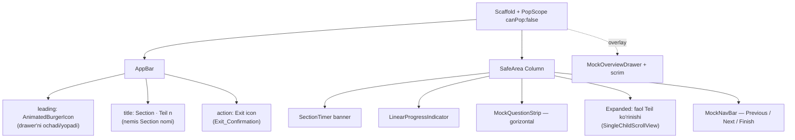
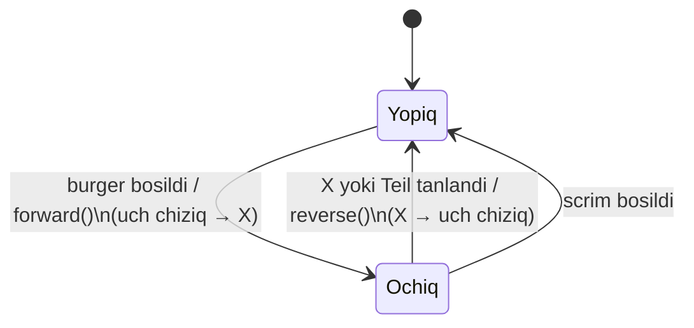
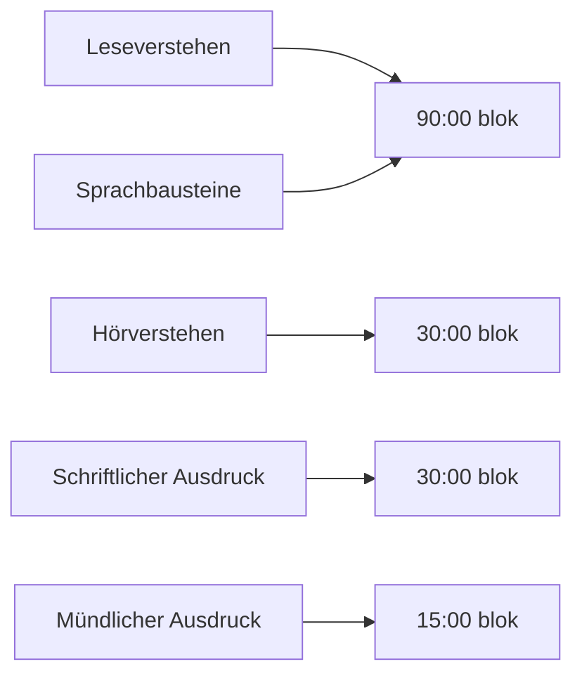
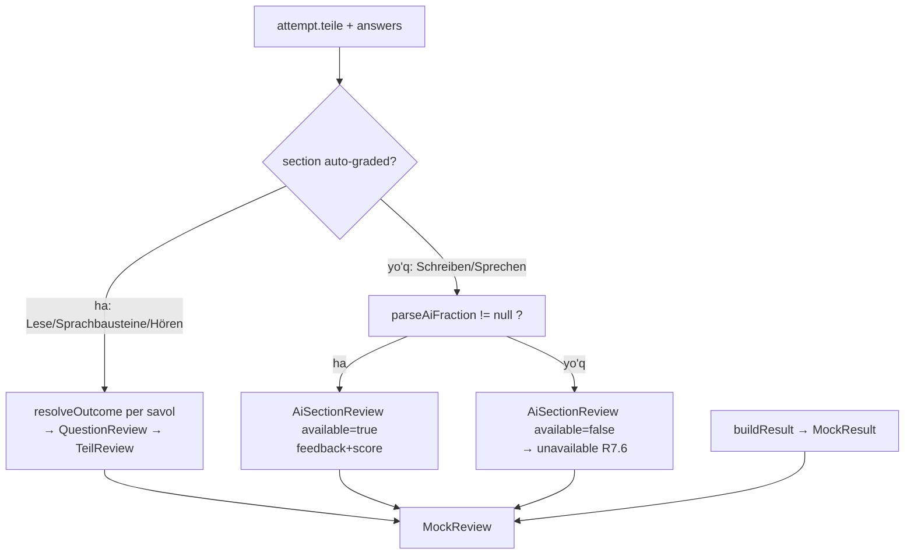

# Design Document: B1 Mock Test Redesign

## Overview

**B1 Mock Test Redesign** — bu mavjud `b1-mock-test` funksiyasining **taqdimot (presentation)
qatlamini** qayta loyihalash bosqichi. Maqsad: runner, intro va result ekranlarini ilovaning
umumiy dizayn tiliga (`GamifiedCard`, `AppColors`, `ThemeManager`) to'liq moslashtirish, runnerga
animatsiyali **burger/overview drawer**, yuqorida **sanab turuvchi taymer**, gorizontal
**savol-navigatsiya tasmasi** va pastda **Previous/Next + alohida Finish** boshqaruvini qo'shish,
hamda result ekranida **har bir savol bo'yicha review** ko'rsatish.

### Asosiy loyihalash tamoyili: domen yadrosi o'zgarmaydi

Bu spec'ning markaziy cheklovi (Requirement 10) — **domen yadrosi qayta yozilmaydi**:

| Qatlam | Fayl | Holat |
|---|---|---|
| Assembler | `model/mock_test_assembler.dart` | **O'zgarmaydi** |
| Scorer | `model/mock_test_scorer.dart` | **O'zgarmaydi** |
| Attempt modellari | `model/mock_test_attempt.dart` | **O'zgarmaydi** |
| Structure | `model/mock_test_structure.dart` | **O'zgarmaydi** (faqat o'qiladi) |
| Exceptions | `model/mock_test_exceptions.dart` | **O'zgarmaydi** |
| Controller | `mock_test_controller.dart` | Faqat **read-only yordamchi metodlar** + bitta pozitsiya-navigatsiya metodi bilan kengaytiriladi |
| Section views (4 ta) | `views/*.dart` | Taqdimot darajasida moslanadi (baholash/yig'ish mantig'i tegilmaydi) |
| Intro / Runner / Result | `mock_test_*_screen.dart` | Qayta loyihalanadi (assembly/scoring chaqiruvlari saqlanadi) |

Baholash (`MockTestScorer.score`) va yig'ish (`MockTestAssembler.assemble`) chaqiruvlari aynan
hozirgidek qoladi; redesign faqat ularning **atrofidagi UI** va `MockResult`/`MockTestAttempt`
ma'lumotlarini **o'qib ko'rsatish** usulini o'zgartiradi.

### Qo'shiladigan / qayta loyihalanadigan komponentlar

1. **`MockTestController` kengaytmasi** — per-savol to'g'ri/noto'g'rilikni aniqlovchi read-only
   metodlar (`outcomeFor`, `buildReview`) va drawer uchun pozitsiya-navigatsiya (`goToTeil`).
2. **`MockOverviewDrawer` + `AnimatedBurgerIcon`** — barcha Section/Teile ro'yxati, joriy Teil
   ajratib ko'rsatilgan, burger → X animatsiyasi (≤400 ms).
3. **`SectionTimer`** — Section bloki bo'yicha sanab turuvchi taymer; pure `computeTimerState`
   funksiyasi orqali normal / ogohlantirish / vaqt-tugadi holatlarini aniqlaydi.
4. **`MockQuestionStrip`** — gorizontal, suriladigan savol-navigatsiya tasmasi (javob berilgan /
   berilmagan farqi bilan).
5. **`MockNavBar` (qayta loyihalangan)** — Previous/Next pastda; oxirgi Teil'da Next disabled va
   alohida Finish boshqaruvi.
6. **Result review** — `MockReview` modeli asosida per-savol review bo'limi.

---

## Architecture

### Yuqori darajadagi tuzilma

Redesign mavjud qatlamlanishni saqlaydi: **pure domen yadrosi → controller (yagona mutable holat)
→ presentation**. Yangi UI komponentlari faqat controller va `MockResult`/`MockReview`'ni o'qiydi.



### Runner ekran kompozitsiyasi



### Drawer ↔ burger animatsiyasi sinxronizatsiyasi

Bitta `AnimationController` (davomiyligi `300 ms`, ≤400 ms cheklovini qondiradi — Requirement 3.4)
ham burger ikonkasini (`AnimatedIcons.menu_close`), ham drawer slayd/scrim animatsiyasini boshqaradi.
`progress = 0` → uch chiziq + drawer yopiq; `progress = 1` → "X" + drawer ochiq.



### Vaqt bloklari (Section_Timer)

TELC B1 rasmiy vaqt me'yorlari Section'larni **timed bloklar**ga guruhlaydi. Lesever­stehen va
Sprachbausteine bitta 90-daqiqalik blokda birga sanaydi; qolganlari alohida.



Joriy Teil qaysi blokka tegishli bo'lsa, taymer o'sha blokning **qolgan vaqtini** sanaydi. Blok
faqat faol bo'lganda sanaydi; boshqa blokka o'tib qaytilsa, qolgan vaqt o'sha joydan davom etadi
(imtihon-vaqtini boshqarish realizmi). Taymer **faqat presentation holati** — domen yadrosiga
tegmaydi va attempt'ni avtomatik yakunlamaydi (Requirement 5.7).

> **Loyihalash qarori (5.3):** "qolgan vaqt" har blok uchun saqlanadi va faol bo'lganda davom
> etadi (reset emas). Bu real imtihondagi vaqt boshqaruviga eng mos talqin. Muqobil (har kirishda
> reset) rad etildi, chunki u "qolgan vaqt"ni boshqacha ma'noda talqin qiladi.

---

## Components and Interfaces

### 1. `MockTestController` kengaytmasi (read-only + navigatsiya)

Mavjud controller o'zgarmasdan qoladi; quyidagilar **qo'shiladi**. Hech biri assembled `attempt`'ni,
`answers`'ni yoki AI natijalarini o'chirmaydi/o'zgartirmaydi.

```dart
/// Bitta auto-graded savol natijasi.
enum QuestionOutcome { correct, incorrect, unanswered }

extension MockTestReview on MockTestController {
  // ── Navigatsiya (faqat pozitsiya — next()/previous() bilan bir oilada) ──
  /// Drawer'dan tanlangan Teil'ga o'tadi. Faqat [_currentTeilIndex]'ni
  /// o'zgartiradi; assembled content, answers va AI natijalari tegilmaydi.
  /// Diapazondan tashqari [index] e'tiborsiz qoldiriladi (no-op).
  void goToTeil(int index);

  // ── Read-only review yordamchilari (Requirement 7, 10.2) ──
  /// Auto-graded savol natijasi: javob berilmagan → unanswered; tanlangan ==
  /// correctAnswer → correct; aks holda incorrect.
  QuestionOutcome outcomeFor(AnswerKey key);

  /// Tugatilgan attempt uchun to'liq, immutable review modelini quradi
  /// (per-savol auto-graded natijalar + AI Section feedback/unavailable).
  /// Faqat mavjud holatni o'qiydi — holatni o'zgartirmaydi.
  MockReview buildReview();
}
```

**Eslatma (R10):** `goToTeil` — mavjud `next()`/`previous()` bilan bir xil toifadagi pozitsiya
mutatsiyasi (cursor'ni siljitadi, frozen attempt'ni emas). U baholash/yig'ish xulqini
o'zgartirmaydi, shuning uchun R10.1 buzilmaydi. `outcomeFor` va `buildReview` to'liq pure
derivatsiya (R10.2 read-only).

`outcomeFor` ning yadrosi pure top-level funksiya orqali amalga oshiriladi (property-test uchun):

```dart
/// Pure: tanlangan variant va to'g'ri javobdan natijani aniqlaydi.
QuestionOutcome resolveOutcome(String? selected, String correctAnswer) {
  if (selected == null) return QuestionOutcome.unanswered;
  return selected == correctAnswer
      ? QuestionOutcome.correct
      : QuestionOutcome.incorrect;
}
```

### 2. `MockOverviewDrawer` + `AnimatedBurgerIcon`

```dart
class AnimatedBurgerIcon extends StatelessWidget {
  final Animation<double> progress; // 0 = burger, 1 = X
  final VoidCallback onTap;
  // AnimatedIcon(icon: AnimatedIcons.menu_close, progress: progress)
}

class MockOverviewDrawer extends StatelessWidget {
  final MockTestController controller;
  final Animation<double> animation;       // slide + scrim
  final void Function(int teilIndex) onSelectTeil;
  final VoidCallback onClose;
  // Section'lar nemis nomida (mockSectionGermanName) official tartibda;
  // har Section ostida Teile ro'yxati; joriy Teil ajratilgan (accent rang).
}
```

- **R2.2 / R9.4:** Drawer barcha 5 Section'ni (Leseverstehen, Sprachbausteine, Hörverstehen,
  Schriftlicher Ausdruck, Mündlicher Ausdruck) va ularning Teile'larini `MockTestStructure`
  tartibida ko'rsatadi.
- **R2.3:** Teil tanlanganda → `controller.goToTeil(index)` + drawer yopiladi (`reverse()`).
- **R2.4:** Joriy faol Teil `controller.currentTeilIndex` bo'yicha accent rang bilan ajratiladi.
- **R2.5:** Navigatsiya javoblarni o'zgartirmaydi (`answers` map tegilmaydi).
- **R2.6 / R11.2:** Section nomlari har doim nemischa (`mockSectionGermanName`).
- **R3:** Burger ikonkasi va drawer bitta `AnimationController` (300 ms) bilan sinxron.

### 3. `SectionTimer` (taymer)

```dart
/// Taymer ko'rinish holati (pure'dan kelib chiqadi).
enum TimerPhase { normal, warning, timeUp }

@immutable
class SectionTimerState {
  final TimerPhase phase;
  final Duration remaining; // timeUp'da Duration.zero
}

/// Pure: qolgan vaqt va ogohlantirish chegarasidan holatni aniqlaydi.
/// Side-effect yo'q — hech qachon auto-submit qilmaydi (R5.7).
SectionTimerState computeTimerState(Duration remaining, Duration warningThreshold);

/// Section → timed blok va uning rasmiy davomiyligi.
class MockTestTiming {
  static const Duration leseSprachbausteine = Duration(minutes: 90);
  static const Duration hoeren             = Duration(minutes: 30);
  static const Duration schreiben          = Duration(minutes: 30);
  static const Duration sprechen           = Duration(minutes: 15);
  static const Duration warningThreshold   = Duration(minutes: 1);

  static Object blockKeyOf(MockSection s);   // Lese+Sprachbausteine → bir kalit
  static Duration allowanceOf(MockSection s);
}

class SectionTimer extends StatefulWidget {
  final MockTestController controller; // joriy Section'ni kuzatadi
}
```

- **R5.1 / R5.2:** Runner tepasida joriy Section blokining qolgan vaqtini `mm:ss` sanaydi.
- **R5.3:** Boshqa Section'ga o'tilganda o'sha blokning qolgan vaqtini ko'rsatadi (saqlangan).
- **R5.4:** `0 < remaining ≤ warningThreshold` → `warning` (rang o'zgaradi, masalan `duoOrange`).
- **R5.5 / R5.6:** `remaining == 0` → `timeUp`: ogohlantirish to'xtaydi, "00:00" o'rniga alohida
  "vaqt tugadi" xabari (`l.mockTimerExpired`).
- **R5.7:** `timeUp`'da attempt avtomatik yakunlanmaydi — talaba ishlashda davom etadi.
- **R5.8 / R11.1:** Raqamlar (`mm:ss`) sanoqda; atrof matn (label) `AppLocalizations` orqali.
- Taymer `Timer.periodic(1s)` bilan ishlaydi; holat presentation'da, controller'ga tegmaydi.

### 4. `MockQuestionStrip` (gorizontal savol-navigatsiya)

```dart
class MockQuestionStrip extends StatelessWidget {
  final int count;                       // joriy Teil'dagi savollar soni
  final int activeIndex;
  final bool Function(int index) isAnswered;
  final void Function(int index) onSelect;
  // Gorizontal ListView; doira/pill indikatorlar.
}
```

- **R4.1 / R4.2:** Joriy Teil savollari gorizontal, suriladigan tasmada; indikator bosilganda
  o'sha savol faollashadi.
- **R4.4:** Javob berilgan (accent/yashil to'ldirilgan) va berilmagan (neytral) savollar vizual
  farqlanadi (mavjud `horen_mock_view._buildQuestionButton` uslubi umumlashtiriladi).
- Tasma har Section view ichida "faol savol" indeksini boshqaradi. `Hören` allaqachon
  bir-savol-bir-vaqtda ishlaydi; `Lesen` ko'rinishi ham faol savol modeliga moslanadi
  (shared passage/rasm yuqorida qoladi → R4.5 nemis mazmuni kesilmaydi).
- **R4.3:** Qisqa variantlar (Teil 3 harf tanlovlari a–l, x) gorizontal `Wrap` da
  (mavjud `_buildLetterGrid` qayta ishlatiladi).

### 5. `MockNavBar` (qayta loyihalangan pastki navigatsiya)

Bu **xulq o'zgarishi**: hozirgi runner oxirgi Teil'da Next tugmasini "Finish"ga aylantiradi;
yangi talab (R8) buni taqiqlaydi.

```dart
class MockNavBar extends StatelessWidget {
  final bool canGoBack;     // !isOnFirstTeil → R8.1
  final bool canGoNext;     // !isOnFinalTeil
  final bool isFinalTeil;   // → Finish faqat shu yerda
  final VoidCallback onPrevious;
  final VoidCallback onNext;
  final VoidCallback onFinish;
}
```

| Holat | Previous | Next | Finish |
|---|---|---|---|
| Birinchi Teil (R8.1) | yashirin | faol | yashirin (R8.6) |
| O'rta Teil (R8.2) | faol | faol | yashirin (R8.6) |
| Oxirgi Teil (R8.3/8.4/8.5) | faol | **disabled** (Finish'ga aylanmaydi) | **alohida, faol** |

- **R8.5:** Oxirgi Teil'da Finish bosilsa → `controller.buildResult()` + `controller.buildReview()`
  → `MockTestResultScreen`.
- **R8.6:** Oxirgi Teil'dan boshqa hech qaerda Finish ko'rinmaydi — erta yakunlash imkonsiz.
- **R8.7 / R1:** Tugmalar `AppColors` + accent + dark rejimda.

### 6. Result review (`MockTestResultScreen` kengaytmasi)

`MockTestResultScreen` endi `MockResult` **va** `MockReview` qabul qiladi:

```dart
class MockTestResultScreen extends StatelessWidget {
  final MockResult result;   // mavjud — totallar/pass-fail (saqlanadi, R7.7)
  final MockReview review;   // yangi — per-savol review (R7.1–7.6)
}
```

- **R7.7:** Mavjud hero, written/oral total kartalari va Section ball kartalari **aynan saqlanadi**.
- Ularning ostiga **Question_Review** bo'limi qo'shiladi:
  - **R7.1 / R7.2 / R7.3 / R7.4:** Har bir Auto_Graded_Section savoli uchun: savol matni (nemischa),
    talaba tanlagan variant, to'g'ri variant va `QuestionOutcome` (correct = yashil, incorrect/
    unanswered = qizil). Javob berilmagan → "incorrect (javob berilmagan)".
  - **R7.5:** AI_Evaluated_Section (Schreiben/Sprechen) uchun per-savol belgisi o'rniga AI bahosi
    va feedback (`schreibenFeedback` / `sprechenEvaluation`).
  - **R7.6:** AI bahosi yo'q bo'lsa → o'sha Section uchun "baholash mavjud emas"
    (`l.mockResultUnavailable`); qolgan Section'lar review'iga to'sqinlik qilmaydi.
- **R11.2:** Savol/variant matnlari nemischa; yorliqlar (`To'g'ri javob`, `Sizning javobingiz`)
  lokalizatsiya qilinadi.

### 7. Exit confirmation (o'zgarmaydi — R6)

Mavjud `_confirmExit` + `PopScope` mantig'i saqlanadi. Faqat dizayn jihatdan `AppColors`/
lokalizatsiya bilan moslanadi (allaqachon shunday). Burger qo'shilgani uchun exit endi AppBar
trailing action'ida alohida ikonka (`Icons.logout_rounded`) orqali — burger→X morfi bilan
chalkashmaydi. Davom etish tanlansa, talaba aynan o'sha Teil/javob/pozitsiyada qoladi (R6.2),
chunki hech narsa tozalanmaydi.

### Lokalizatsiya (R11) — yangi kalitlar

`AppLocalizations`'ga `_t({uz, kaa, ru, de})` uslubida qo'shiladi (uz fallback — R11.3). Mavjud
mock kalitlari (`mockNextTeil`, `mockExitTitle`, ...) qayta ishlatiladi. Yangilar (taxminiy):

| Kalit | Maqsad |
|---|---|
| `mockOverviewTitle` | Drawer sarlavhasi ("Imtihon tuzilishi") |
| `mockTimerLabel` | Taymer atrofidagi matn ("Qolgan vaqt") |
| `mockTimerExpired` | "Vaqt tugadi" holati (R5.6) |
| `mockReviewTitle` | Review bo'limi sarlavhasi |
| `mockReviewYourAnswer` | "Sizning javobingiz" |
| `mockReviewCorrectAnswer` | "To'g'ri javob" |
| `mockReviewUnanswered` | "Javob berilmagan" |
| `mockExitTooltip` | Exit ikonka tooltip'i |

German exam mazmuni (savollar, passajlar, Section/Teil nomlari) hech qachon lokalizatsiya
qilinmaydi (R11.2).

---

## Data Models

Mavjud domen modellari (`MockTestAttempt`, `MockTeil`, `SelectedTest`, `AnswerKey`, `MockResult`,
`MockSection`, `TeilSpec`) **o'zgarmaydi**. Quyidagi yangi modellar **faqat presentation/review**
uchun qo'shiladi va pure (Flutter/I-O bog'liqligi yo'q) bo'lib, property-test qilinadi.

### Review modellari

```dart
/// Bitta auto-graded savolning review qatori.
@immutable
class QuestionReview {
  final int questionIndex;
  final String prompt;          // nemis mazmuni (R11.2)
  final String? selectedOption; // null → javob berilmagan
  final String correctOption;
  final QuestionOutcome outcome;
}

/// Bitta Teil review'i (auto-graded Section ichida).
@immutable
class TeilReview {
  final MockSection section;
  final int teilNumber;
  final List<QuestionReview> questions; // unmodifiable
}

/// AI Section review'i (Schreiben / Sprechen).
@immutable
class AiSectionReview {
  final MockSection section;
  final bool available;     // false → "baholash mavjud emas" (R7.6)
  final String? feedback;   // schreibenFeedback yoki sprechenEvaluation.overall
  final String? score;      // masalan "16/20" (mavjud bo'lsa)
}

/// To'liq review modeli — controller.buildReview() qaytaradi.
@immutable
class MockReview {
  final MockResult result;                 // totallar/pass-fail (R7.7)
  final List<TeilReview> autoGraded;       // unmodifiable
  final List<AiSectionReview> aiSections;  // unmodifiable
}
```

### Taymer modellari

```dart
enum TimerPhase { normal, warning, timeUp }

@immutable
class SectionTimerState {
  final TimerPhase phase;
  final Duration remaining;
}
```

### Yangi enum

```dart
enum QuestionOutcome { correct, incorrect, unanswered }
```

### Ma'lumot oqimi (review qurish)

`buildReview()` mavjud holatdan quyidagicha derivatsiya qiladi (model-based — scorer bilan
mos kelishi property orqali tekshiriladi):



---

## Correctness Properties

*A property is a characteristic or behavior that should hold true across all valid executions of a
system — essentially, a formal statement about what the system should do. Properties serve as the
bridge between human-readable specifications and machine-verifiable correctness guarantees.*

Bu redesign asosan UI/UX bo'lgani uchun ko'pchilik acceptance criteria widget/example testlari bilan
qoplanadi (Testing Strategy'ga qarang). Quyidagi xususiyatlar **yangi qo'shilgan pure mantiq** uchun
universal kafolatlar beradi: review derivatsiyasi (scorer bilan model-based mos kelishi), taymer
holati klassifikatsiyasi, navigatsiya/read-only holat o'zgarmasligi, va Section view to'liqligi.
Mavjud assembler/scorer xususiyatlari **o'zgarmaydi** va qayta yozilmaydi (R10.1).

### Property 1: Auto-graded review per-savol to'g'riligi (scorer bilan model-based)

*For any* assembled `MockTestAttempt` and *any* map of recorded answers, `buildReview().autoGraded`
contains exactly one `QuestionReview` for every Question of every auto-graded Teil
(Leseverstehen, Sprachbausteine, Hörverstehen), where each row's `correctOption` equals that
Question's `correctAnswer`, its `selectedOption` equals `answerFor(key)` (null when unanswered),
its `outcome` equals `resolveOutcome(selected, correct)` (unanswered ⇒ `unanswered`, never
`correct`), and the total number of `correct` outcomes equals
`MockTestScorer.autoGradeCount` over the same questions and answers.

**Validates: Requirements 7.1, 7.2, 7.3, 7.4**

### Property 2: AI Section review mavjudligi (scorer bilan model-based)

*For any* assembled attempt and *any* `schreibenFeedback` string and *any* `sprechenEvaluation`,
each `AiSectionReview` produced by `buildReview()` has `available == (MockTestScorer.parseAiFraction(raw) != null)`
for its raw AI score, the set of AI sections with `available == false` equals
`buildResult().unavailableSections`, and the presence or absence of any AI evaluation never removes
or alters the auto-graded review rows.

**Validates: Requirements 7.5, 7.6**

### Property 3: Navigatsiya va read-only metodlar holatni o'zgartirmaydi

*For any* assembled attempt, *any* recorded answers, and *any* finite sequence of operations drawn
from `{ goToTeil(i), next(), previous(), outcomeFor(key), buildReview() }`, after the sequence the
`answers` map is deep-equal to its initial value, `schreibenFeedback` / `sprechenEvaluation` are
unchanged, the `attempt` reference is identical, and `currentTeilIndex` is always within
`[0, teilCount)` (out-of-range `goToTeil` indices are no-ops).

**Validates: Requirements 2.5, 6.2, 10.2**

### Property 4: Section_Timer holati klassifikatsiyasi

*For any* `remaining` duration `r >= 0` and *any* `warningThreshold` `t > 0`,
`computeTimerState(r, t)` returns exactly one phase such that: `phase == timeUp` iff `r == 0`;
`phase == warning` iff `0 < r <= t`; `phase == normal` iff `r > t`; the three phases are mutually
exclusive; and the function is pure (it returns a state only and never completes the attempt or
produces any side effect).

**Validates: Requirements 5.4, 5.5, 5.7**

### Property 5: Barcha Teile o'z Section ko'rinishiga to'liq xaritalanadi

*For any* assembled `MockTestAttempt`, visiting every Teil index in `[0, teilCount)` resolves the
runner's Teil body to exactly the section view matching that Teil's `SelectedTest` subtype
(`SelectedLesenTest` → `LesenMockView`, `SelectedHorenTest` → `HorenMockView`,
`SelectedSchreibenTest` → `SchreibenMockView`, `SelectedSprechenTest` → `SprechenMockView`) with no
unhandled case and no blank body.

**Validates: Requirements 9.1, 9.2, 9.3**

---

## Error Handling

| Holat | Manba | Ishlov |
|---|---|---|
| Assembly muvaffaqiyatsiz (yetarli kontent yo'q) | `MockTestAssembler.assemble` → `MockAssemblyException` | Mavjud intro xulqi saqlanadi: lokalizatsiyalangan `mockTestCannotAssemble` snackbar, attempt boshlanmaydi. |
| Schreiben AI baholash xatosi | `AIService.evaluateSchreiben` throw | Mavjud xulq: `recordSchreibenFeedback(null)` → Section unavailable; lokalizatsiyalangan xato + retry; talaba davom etadi (R7.6). |
| Sprechen AI/mikrofon xatosi | `SprechenRecordingControl` | Mavjud xulq: evaluation `null` qoladi → Section unavailable; control o'zi xatoni ko'rsatadi. |
| `goToTeil` diapazondan tashqari indeks | Drawer/dasturiy chaqiruv | No-op (Property 3) — holat o'zgarmaydi, crash yo'q. |
| Taymer noli'ga yetdi | `SectionTimer` | `timeUp` holati; auto-submit YO'Q (R5.7, Property 4); talaba ishlashda davom etadi. |
| Hören audio yuklash/ijro xatosi | `HorenMockView` | Mavjud retry affordance saqlanadi. |
| Lesen rasm yuklanmadi | `_ImageCard` | Mavjud `errorWidget` (lokalizatsiyalangan) saqlanadi. |
| Review'da AI feedback yo'q | `buildReview` | `AiSectionReview.available = false` → "baholash mavjud emas"; boshqa Section'lar review'i to'sqinliksiz (R7.6, Property 2). |

Yangi UI komponentlari hech qachon attempt'ni avtomatik tugatmaydi va domen yadrosiga yozmaydi —
xatolar lokal ravishda (snackbar / inline card / no-op) hal qilinadi.

---

## Testing Strategy

### Ikki bosqichli yondashuv

- **Property testlari** — yangi qo'shilgan pure mantiq uchun (Correctness Properties 1–5). Universal
  qamrov, randomizatsiya orqali.
- **Widget / example testlari** — UI, animatsiya, layout, drawer, navbar holatlari, lokalizatsiya va
  dizayn-tizimi moslashuvi uchun (prework'da EXAMPLE/SMOKE deb belgilangan criteria).

### Property-based testing

- **Kutubxona:** Dart uchun mavjud PBT kutubxonasidan foydalaniladi (masalan `package:glados` yoki
  `package:fast_check`/`propcheck` qaysi biri pubspec'da bo'lsa). Noldan PBT yozilmaydi.
- **Generatorlar:** Sintetik `MockTestAttempt` (lesen/horen savollari `correctAnswer` + `options`
  bilan; schreiben/sprechen whole-unit), tasodifiy `answers` (to'g'ri/noto'g'ri/bo'sh aralash),
  tasodifiy AI score stringlari (parse bo'ladigan "X/Y", parse bo'lmaydigan, null), tasodifiy
  `Duration` qiymatlari (0 dan katta diapazon), tasodifiy navigatsiya ketma-ketliklari.
  Edge-case'lar generatorlarda qoplanadi: bo'sh javoblar, hamma to'g'ri, hamma noto'g'ri, `r == 0`,
  `r == t`, diapazondan tashqari teil indekslari.
- **Iteratsiya:** Har bir property testi kamida **100 iteratsiya**.
- **Model-based:** Property 1 va 2 yangi review derivatsiyasini **o'zgarmagan `MockTestScorer`**ga
  taqqoslaydi (oracle), shu bilan R10.1 (baholash xulqi o'zgarmaydi) ham bilvosita tasdiqlanadi.
- **Teglar:** Har bir property testi dizayn xususiyatiga ishora qiladi:
  `Feature: b1-mock-test-redesign, Property {number}: {property_text}`.
  Har bir xususiyat **bitta** property-test bilan amalga oshiriladi.

### Widget / example testlari (asosiy criteria xaritasi)

| Criteria | Test turi |
|---|---|
| 1.1–1.4 dizayn tizimi / dark / accent / consistency | Widget + snapshot |
| 2.1–2.4, 2.6, 9.4 drawer ko'rinishi/navigatsiya/highlight/german nomlar | Widget |
| 3.1–3.4 burger↔X animatsiya + ≤400 ms | Widget + duration assert |
| 4.1–4.4 savol-strip, faol savol, harf-grid, answered farqi | Widget |
| 5.1–5.3, 5.6, 5.8 taymer ko'rinishi/allowance/blok/expired label/format | Widget + unit (`allowanceOf`, `blockKeyOf`) |
| 6.1, 6.3, 6.4 exit dialog ko'rsatish/tasdiqlash/dizayn | Widget |
| 7.7 result totallar saqlanishi | Unit (`buildReview().result == buildResult()`) |
| 8.1–8.7 navbar holatlari (Previous/Next/Finish, disabled, no early finish) | Widget |
| 9.2, 9.3 Schreiben/Sprechen Teil → mos view | Widget |
| 10.1, 10.3 domen yadrosi o'zgarmaganligi | Mavjud assembler/scorer property testlarini qayta ishga tushirish (regression) + kod ko'rigi |
| 11.1–11.3 lokalizatsiya + uz fallback | Unit (`_t` har lokal uchun) + widget (german mazmun o'zgarmasligi) |

### Regressiya (R10)

Mavjud domen testlari (`mock_test_assembler` va `mock_test_scorer` property/unit testlari)
**o'zgartirilmasdan** qayta ishga tushiriladi va o'tishi shart. Bu redesign'ning baholash/yig'ish
xulqini buzmaganini kafolatlaydi.

### Manual / visual tekshiruv

`1.4` (tipografiya/spacing izchilligi) va `4.5` (gorizontal layout'da nemis mazmuni kesilmasligi)
SMOKE sifatida vizual ko'rik orqali tekshiriladi — uzun nemis passajlari, Sprachbausteine blanklari
va Teil 3 harf tanlovlari bilan.
