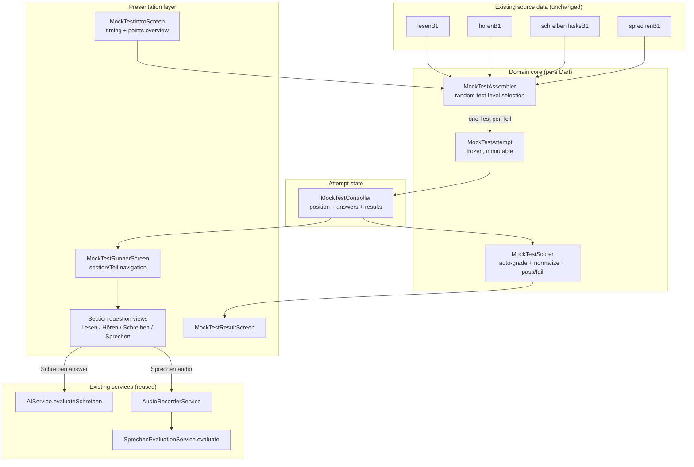
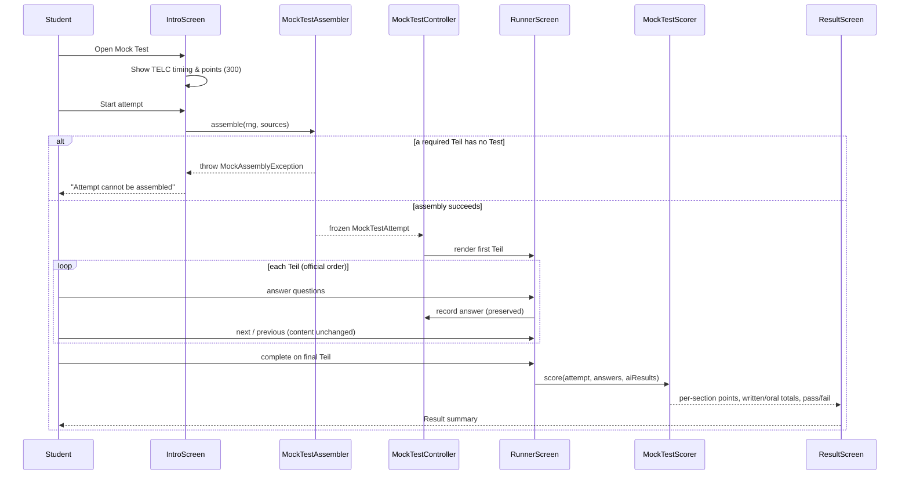

# Design Document

## Overview

The **B1 Mock Test** is a new student-facing Flutter feature that assembles a complete TELC
Deutsch B1 practice examination out of content the app already ships in its B1 learning sections:
`lesenB1`, `horenB1`, `schreibenTasksB1`, and `sprechenB1`. The feature introduces **no new
question content** — it is an *assembler*, *navigator*, and *scorer* on top of existing data
models and existing AI-evaluation flows.

The defining behavior is **test-level random selection**: for every Teil the exam defines, the
feature picks one complete pre-authored *Test* (a whole Aufgabe group) at random, keeps the
questions inside that Test grouped and in their original order, and then **freezes** the whole
selection for the duration of the attempt. Reading (Leseverstehen + Sprachbausteine) and listening
(Hörverstehen) are auto-graded against each question's `correctAnswer`; writing (Schriftlicher
Ausdruck) reuses `AIService.evaluateSchreiben`, and speaking (Mündlicher Ausdruck) reuses the
`SprechenEvaluationService.evaluate` audio-recording flow. The result screen normalizes scores to
the official TELC B1 point values (300 total) and reports pass/fail for the written and oral parts
separately at a 60% threshold. All app-authored text is localized through
`AppLocalizations._t({...})` (uz, kaa, ru, de) with an Uzbek fallback, while the German exam
content stays German.

### Design Goals

- Reuse existing data models (`LesenLevel`, `HorenLevel`, `SprechenLevel`, `SchreibenTask`) and
  existing services without modification.
- Keep the **assembly** and **scoring** logic in pure, side-effect-free functions so they are
  deterministic given a seeded random source and directly property-testable.
- Keep the UI (rendering, audio playback, recording) thin and built from the patterns already used
  in `lesen_question_screen`, `horen_question_screen`, and `sprechen_teil_screen`.
- Treat an assembled attempt as immutable; only the student's answers are mutable state.

### Key Findings from Codebase Research

The design is grounded in the following facts discovered in the existing code:

- **Lesen** (`lib/screens/student/lesen/lesen_data.dart`): `lesenB1` is a `LesenLevel` with five
  `LesenTeil`s. `teilNumber` 1–3 are **Leseverstehen** (Globalverstehen, Detailverstehen,
  Selektives Verstehen); `teilNumber` 4–5 are **Sprachbausteine**. Each `LesenTeil` exposes
  `questionsPerTest` (5 or 10) and a flat `questions` list; a *Test* is a contiguous chunk of
  `questionsPerTest` questions. `testTexts[i]` / `testImages[i]` (when present) align by chunk
  index to the i-th Test; `sharedText` is the per-Teil fallback passage. `LesenQuestion` carries
  `passage`, `imageUrl`, `prompt`, `options`, and `correctAnswer`.
- **Hören** (`lib/screens/student/horen/horen_data.dart`): `horenB1` is a `HorenLevel` with three
  `HorenTeil`s holding flat `questions` lists. The existing `horen_question_screen` groups them
  into Tests of **5** questions (Teil 1 and Teil 3) and **10** questions (Teil 2). Each
  `HorenQuestion` owns its own `audioUrl`, `question`, `options`, and `correctAnswer`, so audio
  travels with the question automatically.
- **Schreiben** (`lib/utils/schreiben_tasks_b1.dart`, `lib/models/schreiben_task.dart`):
  `schreibenTasksB1` is a `List<SchreibenTask>`; each `SchreibenTask` (with `task`, `points`,
  `style`, `minWords`, `level`, `letter`) is one complete Test. TELC B1 Schreiben has a single
  Teil.
- **Sprechen** (`lib/screens/student/sprechen/sprechen_data.dart`): `sprechenB1` is a
  `SprechenLevel` with three `SprechenTeil`s. Teil 1 and Teil 3 carry only `aufgaben` (one implicit
  Test); Teil 2 carries `tests` (a list of `SprechenTest`, each with `thema` + `aufgaben`).
- **Schreiben AI flow**: `AIService.evaluateSchreiben({taskText, points, style, minWords, answer,
  wordCount, level, letter})` returns a `Future<String>` of Uzbek-language feedback that ends with
  a `Jami: X/20` rubric.
- **Sprechen AI flow**: `SprechenEvaluationService.evaluate({audioBytes, mimeType, ...})` returns a
  `Future<AudioEvaluation>` (fields `score` like `"16/20"`, plus `pronunciation`, `fluency`,
  `grammar`, `content`, `overall`). The recording UX is a state machine
  (`RecordingPhase`) driven by `AudioRecorderService` and surfaced by
  `sprechen_recording_control.dart`.
- **TTS**: `TTSService` (Amazon Polly with `flutter_tts` fallback) is used for synthesized German
  speech; Hören instead plays pre-recorded MP3s via `audioplayers` directly. The mock test follows
  the Hören pattern for listening audio.
- **Localization**: `AppLocalizations._t(Map<String,String>)` returns `map[_code] ?? map['uz'] ??
  map.values.first`, so a missing locale key automatically falls back to Uzbek.

## Architecture

The feature splits into a **pure domain core** (assembly + scoring, no Flutter, no I/O) and a thin
**presentation layer** (screens that render the assembled attempt and collect answers). This split
is what makes the random selection and scoring rules property-testable.



### Attempt Lifecycle



### Layering and File Layout

New code lives under `lib/screens/student/mock_test/` with the pure core under a `model/`
subfolder so tests can import it without pulling in Flutter widgets:

```
lib/screens/student/mock_test/
  model/
    mock_test_structure.dart   // MockSection, TeilSpec, official structure & points table
    mock_test_attempt.dart     // MockTeil, MockTestAttempt, selected-test wrappers
    mock_test_assembler.dart   // pure assemble(rng, sources) -> MockTestAttempt
    mock_test_scorer.dart      // pure auto-grade, normalize, pass/fail
    mock_test_exceptions.dart  // MockAssemblyException
  mock_test_controller.dart    // ChangeNotifier: position + answers + AI results
  mock_test_intro_screen.dart  // replaces the current placeholder entry for B1
  mock_test_runner_screen.dart // section/Teil navigation host
  views/
    lesen_mock_view.dart
    horen_mock_view.dart
    schreiben_mock_view.dart
    sprechen_mock_view.dart
  mock_test_result_screen.dart
```

The current `lib/screens/student/mock_test_screen.dart` placeholder is retained as the level
chooser; selecting **B1** routes to `MockTestIntroScreen` instead of the "coming soon" dialog.

## Components and Interfaces

### MockTestStructure (official exam definition)

A single source of truth that maps the official TELC B1 layout to the source data models. It does
not hold question content — only which source Teile feed which Section, the official order, the
point values, and the timing labels.

```dart
enum MockSection {
  leseverstehen,        // 75 points, lesenB1 teile 1..3
  sprachbausteine,      // 30 points, lesenB1 teile 4..5
  hoerverstehen,        // 75 points, horenB1 teile 1..3
  schriftlicherAusdruck,// 45 points, schreibenTasksB1
  muendlicherAusdruck,  // 75 points, sprechenB1 teile 1..3
}

class TeilSpec {
  final MockSection section;
  final int teilNumber;       // matches source teilNumber
  final int questionsPerTest; // chunk size; 0 = whole-unit (Schreiben/Sprechen)
}

class MockTestStructure {
  static const int totalPoints = 300;
  static const Map<MockSection, int> sectionMaxPoints = {
    MockSection.leseverstehen: 75,
    MockSection.sprachbausteine: 30,
    MockSection.hoerverstehen: 75,
    MockSection.schriftlicherAusdruck: 45,
    MockSection.muendlicherAusdruck: 75,
  };

  /// Official presentation order (written part first, oral last).
  static const List<MockSection> sectionOrder = [
    MockSection.leseverstehen,
    MockSection.sprachbausteine,
    MockSection.hoerverstehen,
    MockSection.schriftlicherAusdruck,
    MockSection.muendlicherAusdruck,
  ];

  static const Set<MockSection> writtenSections = {
    MockSection.leseverstehen, MockSection.sprachbausteine,
    MockSection.hoerverstehen, MockSection.schriftlicherAusdruck,
  };
  static const MockSection oralSection = MockSection.muendlicherAusdruck;

  /// Ordered list of every Teil the exam must contain.
  static const List<TeilSpec> teilSpecs = [ /* ... */ ];
}
```

The auto-graded section maxima are split across their Teile proportionally by question count so a
section's per-question weight is uniform (e.g. Hörverstehen 75 points over its presented questions).

### MockTestAssembler (pure)

Performs the random, test-level selection. It is deterministic given an injected `Random`, which is
what makes selection property-testable (seeded RNG) while production uses `Random.secure()` /
`Random()`.

```dart
class MockTestAssembler {
  /// Builds one frozen attempt. Throws [MockAssemblyException] if any required
  /// Teil exposes zero Tests.
  static MockTestAttempt assemble({
    required Random rng,
    LesenLevel lesen = lesenB1Source,
    HorenLevel horen = horenB1Source,
    List<SchreibenTask> schreiben = schreibenTasksB1Source,
    SprechenLevel sprechen = sprechenB1Source,
  });

  /// Splits a Teil's flat question list into contiguous Tests of [perTest].
  static List<List<T>> chunk<T>(List<T> questions, int perTest);

  /// Selects one index in [0, count) uniformly; for count == 1 returns 0.
  static int selectIndex(Random rng, int count);
}
```

Selection rules:
- **Lesen**: for each `LesenTeil`, build Tests by chunking `questions` into groups of
  `questionsPerTest`. Pick group index `g`; the selected Test carries that question slice plus
  `testTexts?[g]` / `testImages?[g]` (falling back to `sharedText` for the passage when no
  per-test text exists).
- **Hören**: for each `HorenTeil`, chunk by 5 (Teil 1, 3) or 10 (Teil 2); pick one group. Audio is
  intrinsic to each `HorenQuestion`.
- **Schreiben**: the available Tests are the elements of `schreibenTasksB1`; pick one
  `SchreibenTask`.
- **Sprechen**: for each `SprechenTeil`, if `tests` is non-empty the Tests are those `SprechenTest`s
  (pick one); otherwise the single `aufgaben` group is the only Test.

### MockTestAttempt and selected-test wrappers (immutable)

```dart
@immutable
class MockTestAttempt {
  final List<MockTeil> teile; // already in official Section + ascending teilNumber order
  const MockTestAttempt(this.teile);
  Iterable<MockTeil> sectionTeile(MockSection s) => /* filtered, ordered */;
}

@immutable
class MockTeil {
  final MockSection section;
  final int teilNumber;
  final SelectedTest test; // sealed: Lesen | Horen | Schreiben | Sprechen
}
```

`SelectedTest` is a sealed hierarchy:
- `SelectedLesenTest(List<LesenQuestion> questions, String? text, String? imageUrl)`
- `SelectedHorenTest(List<HorenQuestion> questions)`
- `SelectedSchreibenTest(SchreibenTask task)`
- `SelectedSprechenTest(String? thema, List<SprechenAufgabe> aufgaben)`

All fields are `final`; lists are wrapped with `List.unmodifiable` at construction so the attempt
cannot be mutated after assembly.

### MockTestController (ChangeNotifier)

Owns the only mutable state of an attempt: the current position and the student's answers/results.
The assembled `MockTestAttempt` it holds is never replaced during the attempt.

```dart
class MockTestController extends ChangeNotifier {
  final MockTestAttempt attempt;
  int currentTeilIndex = 0;

  // Auto-graded answers, keyed by (teilIndex, questionIndex).
  final Map<AnswerKey, String> answers = {};
  // AI results captured during the attempt.
  String? schreibenFeedback;            // raw Uzbek feedback text
  AudioEvaluation? sprechenEvaluation;  // parsed AI evaluation

  void selectAnswer(AnswerKey key, String option); // preserved across navigation
  void next(); void previous();         // move within teile, content unchanged
  bool get isOnFinalTeil;
  MockResult buildResult();             // delegates to MockTestScorer
}
```

### MockTestScorer (pure)

```dart
class MockTestScorer {
  /// Correct answers among presented questions; unanswered => incorrect.
  static int autoGradeCount(List<({String correct})> questions, Map<int,String?> answers);

  /// Linear normalization, clamped to [0, max].
  static int normalize(int correct, int total, int max);

  /// Parses "X/Y" style AI scores into a fraction; null/unparseable => null.
  static double? parseAiFraction(String rawScore);

  static MockResult score({
    required MockTestAttempt attempt,
    required Map<AnswerKey,String> answers,
    String? schreibenFeedback,
    AudioEvaluation? sprechenEvaluation,
  });
}

@immutable
class MockResult {
  final Map<MockSection,int> sectionPoints;   // missing AI => section omitted/flagged
  final Set<MockSection> unavailableSections;  // AI evaluation could not complete
  final int writtenPoints; final int writtenMax;   // 225
  final int oralPoints;    final int oralMax;      // 75
  bool get writtenPassed; // writtenPoints >= 0.6 * writtenMax
  bool get oralPassed;    // oralPoints    >= 0.6 * oralMax
}
```

### Presentation layer

- **MockTestIntroScreen**: shows the official timing (Leseverstehen + Sprachbausteine combined 90
  min, Hörverstehen listening allowance, Schriftlicher Ausdruck 30 min, Mündlicher Ausdruck
  preparation + speaking) and the 300-point total; a **Start** button triggers assembly. On
  `MockAssemblyException` it shows a localized "cannot be assembled" message instead of starting.
- **MockTestRunnerScreen**: hosts a non-shuffling navigator over `attempt.teile`, shows a position
  indicator ("Section · Teil n"), an "advance" control, a "complete" control on the final Teil, and
  intercepts back navigation with a confirmation dialog (`WillPopScope`/`PopScope`).
- **Section views** reuse existing UI patterns:
  - `lesen_mock_view` mirrors `lesen_question_screen` (passage/image + options).
  - `horen_mock_view` mirrors `horen_question_screen` (audioplayers playback + options).
  - `schreiben_mock_view` mirrors `schreiben_screen` (letter + 4 points + text field), submits via
    `AIService.evaluateSchreiben`.
  - `sprechen_mock_view` embeds the existing `sprechen_recording_control` widget and
    `SprechenEvaluationService.evaluate`.
- **MockTestResultScreen**: renders per-Section points normalized to TELC maxima, the written and
  oral totals, and pass/fail badges; shows an "evaluation unavailable" note for any AI section that
  failed while still presenting the rest.

## Data Models

The feature adds the wrapper/domain models listed above and reuses the existing source models
unchanged. Summary of the data relationships:

| Section | Source | Teile | Test unit | Tests per Teil | Max points |
|---|---|---|---|---|---|
| Leseverstehen | `lesenB1` teile 1–3 | 3 | chunk of `questionsPerTest` questions (+ text/image) | many | 75 |
| Sprachbausteine | `lesenB1` teile 4–5 | 2 | chunk of 10 questions (+ text) | many | 30 |
| Hörverstehen | `horenB1` teile 1–3 | 3 | chunk of 5 / 10 questions | many | 75 |
| Schriftlicher Ausdruck | `schreibenTasksB1` | 1 | one `SchreibenTask` | list length | 45 |
| Mündlicher Ausdruck | `sprechenB1` teile 1–3 | 3 | `SprechenTest` or single `aufgaben` group | tests or 1 | 75 |

`AnswerKey` is a value-equality key analogous to the existing `AufgabeKey`:

```dart
@immutable
class AnswerKey {
  final int teilIndex;      // index into attempt.teile
  final int questionIndex;  // index within that Teil's selected Test
  const AnswerKey(this.teilIndex, this.questionIndex);
  // operator == / hashCode over both fields
}
```

Answers for auto-graded sections store the selected option string and are compared against the
question's `correctAnswer`. AI sections store their raw result objects (feedback string /
`AudioEvaluation`) on the controller.

## Correctness Properties

*A property is a characteristic or behavior that should hold true across all valid executions of a
system — essentially, a formal statement about what the system should do. Properties serve as the
bridge between human-readable specifications and machine-verifiable correctness guarantees.*

The assembly and scoring logic of the Mock Test is pure and deterministic given a seeded random
source, which makes it directly amenable to property-based testing. The following properties were
derived from the acceptance criteria via the prework analysis and consolidated to remove redundancy
(for example, the many "verbatim / grouped / ordered / only-these-questions" criteria collapse into
a single whole-unit selection property).

### Property 1: Whole-unit verbatim selection

*For any* random seed, the selected Test for every Teil consists of exactly one contiguous group of
Questions taken verbatim — same Question objects, same order — from that Teil's source data model,
with no Questions added, removed, reordered, or combined across Tests.

**Validates: Requirements 1.1, 1.3, 2.2, 3.1, 3.2, 3.3, 3.5**

### Property 2: Structural completeness

*For any* random seed, the assembled Attempt contains exactly one selected Test for every Teil
defined by `MockTestStructure.teilSpecs` — no defined Teil is missing and no extra Teil is present.

**Validates: Requirements 1.2**

### Property 3: Valid and reachable random selection

*For any* random seed and any Teil, the selected Test index lies within the range of Tests
available for that Teil; when a Teil exposes exactly one Test that Test is always selected; and
across the space of seeds every available Test index for a Teil is reachable.

**Validates: Requirements 2.1, 2.3, 2.4**

### Property 4: Lesen auxiliary content alignment

*For any* random seed, when a selected Leseverstehen or Sprachbausteine Test corresponds to group
index `g`, the Test's presented text equals `testTexts[g]` (or the Teil's `sharedText` when no
per-test text exists) and its presented image equals `testImages[g]` when such an entry exists.

**Validates: Requirements 3.4**

### Property 5: Section and Teil ordering

*For any* random seed, the Teile of the assembled Attempt appear grouped by Section in the official
order (Leseverstehen, Sprachbausteine, Hörverstehen, Schriftlicher Ausdruck, Mündlicher Ausdruck)
and, within each Section, in ascending `teilNumber`; consequently every written Section precedes
the oral Section.

**Validates: Requirements 5.1, 5.2, 5.3**

### Property 6: Attempt immutability

*For any* assembled Attempt and *any* sequence of navigation and answering operations, the selected
Tests and their Questions remain identical to the moment of assembly (re-reading any Teil yields the
same Questions in the same order).

**Validates: Requirements 4.1, 4.2**

### Property 7: Answer preservation across navigation

*For any* sequence of answer selections interleaved with forward/backward navigation, every answered
Question retains its most recently selected option regardless of how the student moves between Teile.

**Validates: Requirements 4.3**

### Property 8: Fresh, independent assembly per Attempt

*For any* two independent random sources, the two resulting Attempts are each internally valid and
independent — answering or navigating one never alters the other, and each new Attempt is produced
by a fresh selection.

**Validates: Requirements 4.4**

### Property 9: Auto-graded scoring

*For any* set of presented Auto_Graded_Section Questions and *any* mapping of student answers, the
computed correct count equals the number of Questions whose recorded answer equals the Question's
`correctAnswer`; unanswered Questions never count as correct; and the count is always between 0 and
the total number of presented Questions.

**Validates: Requirements 7.1, 7.2, 7.3**

### Property 10: Point normalization

*For any* correct count between 0 and the total presented Questions, the normalized Section points
fall within `[0, sectionMax]`, equal 0 when the correct count is 0, equal `sectionMax` when all
Questions are correct, and never decrease as the correct count increases.

**Validates: Requirements 9.2**

### Property 11: Result totals, pass thresholds, and unavailable sections

*For any* completed Attempt, the written-part total equals the sum of the written Section points
(bounded by 225) and the oral-part total equals the oral Section points (bounded by 75); the written
and oral pass flags are true exactly when their points reach 60% of the available points; and when an
AI evaluation is missing for a Section, that Section is flagged unavailable while every other
Section still receives a valid score.

**Validates: Requirements 8.3, 9.1, 9.3, 9.4**

### Property 12: Localization fallback

*For any* localization map that contains a `uz` entry and *any* active locale code, the
Localization_Service returns the entry for the active locale when present and otherwise returns the
`uz` entry.

**Validates: Requirements 11.3**

## Error Handling

| Condition | Handling | Requirement |
|---|---|---|
| A required Teil exposes zero Tests at assembly time | `MockTestAssembler.assemble` throws `MockAssemblyException`; the Intro screen catches it and shows a localized "Attempt cannot be assembled" message; no attempt is started. | 12.1, 12.2 |
| Schreiben AI evaluation fails (network/parse) | The thrown error is caught in `schreiben_mock_view`; the section is marked unavailable on the controller; the student may still complete and view the rest of the Result_Summary. | 8.3 |
| Sprechen evaluation fails or microphone denied | The existing `SprechenError` types from `sprechen_recording_control` are surfaced as localized messages; the section is flagged unavailable; the rest of the result remains viewable. | 8.3 |
| Hören audio fails to load | Mirror `horen_question_screen`'s audio-error UI (retry affordance); the Question can still be answered. | (UX parity) |
| Student attempts to leave an in-progress attempt | `PopScope` intercepts and shows a localized confirmation dialog before discarding. | 6.4 |
| AI score string is unparseable during normalization | `parseAiFraction` returns null; the section is treated as unavailable rather than scored as zero. | 8.3 |

`MockAssemblyException` carries the offending `MockSection` and `teilNumber` for diagnostics, but
the user-facing message is generic and localized.

## Testing Strategy

### Dual approach

- **Property-based tests** validate the universal correctness properties above against the pure
  domain core (`MockTestAssembler`, `MockTestAttempt`, `MockTestScorer`).
- **Unit / widget tests** validate concrete navigation transitions, UI display, and integration
  points; **mock-based tests** validate the AI-evaluation wiring.

### Property-based testing

- Library: **`package:test` with `glados`** (the established Dart property-based testing library);
  do not hand-roll generators.
- Each property test runs a **minimum of 100 iterations**.
- Selection is made deterministic by injecting a seeded `Random` into `assemble`, so generators can
  drive the seed space.
- Each property test is tagged with a comment referencing its design property, using the format:
  `// Feature: b1-mock-test, Property {number}: {property_text}`.
- Generators:
  - Source-model generators that build synthetic `LesenLevel` / `HorenLevel` / `SprechenLevel` /
    `List<SchreibenTask>` with varying numbers of Teile, Tests, and Questions (including the
    single-Test boundary and the zero-Test malformed case for Property 3 / Property 12).
  - Answer-map generators that mark some Questions answered (correct or incorrect) and leave others
    unanswered (for Properties 7, 9, 10, 11).
  - Navigation-action generators (sequences of `next`/`previous`/`selectAnswer`) for Properties 6
    and 7.
- One property test per numbered property (Properties 1–12).

### Unit, widget, and integration tests

- **Navigation (6.1–6.3)**: controller unit tests for `next`/`previous`/`isOnFinalTeil` and a
  widget test that completing on the final Teil routes to the Result screen.
- **Leave confirmation (6.4)**: widget test that back navigation shows the confirmation dialog.
- **Schreiben AI wiring (8.1)**: test with a mocked `AIService.evaluateSchreiben` asserting it is
  called with the selected `SchreibenTask`'s `task`, `points`, `style`, `minWords`, `letter`, and
  the student's answer/word count.
- **Sprechen AI wiring (8.2)**: test with a mocked `SprechenEvaluationService.evaluate` asserting it
  is invoked with the recorded audio bytes and mime type.
- **Timing & points display (10.1–10.3)**: widget tests asserting the Intro/section UI renders the
  90-minute combined allowance, the listening allowance, the 30-minute Schreiben allowance, the
  Mündlich preparation+speaking allowance, the per-section point values, and the 300-point total.
- **Localization (11.1, 11.2)**: widget tests that switching locale changes app-authored labels but
  leaves German passages/questions unchanged.

### Notes on PBT scope

Property-based testing is applied only to the pure assembly and scoring core. The AI-evaluation
calls (Schreiben, Sprechen), audio playback/recording, UI rendering, and the timing/points display
are validated with mock-based, widget, and example tests instead, since their behavior is either
external, deterministic, or presentational rather than input-varying.
