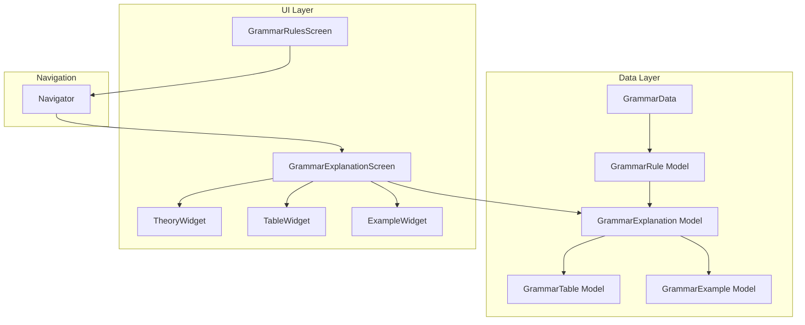
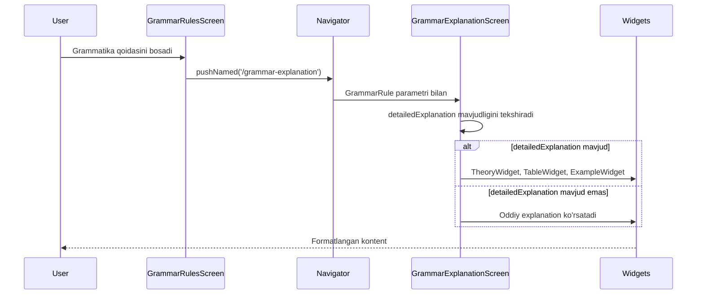
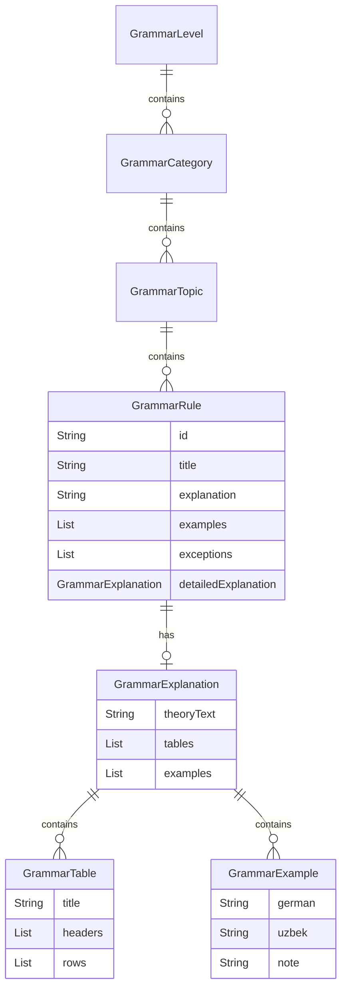

# Technical Design Document: Grammar Explanations Enhancement

## Overview

Ushbu dizayn hujjati grammatika bo'limidagi tushuntirishlarni takomillashtirish funksiyasini texnik jihatdan tavsiflaydi. Maqsad — har bir grammatika qoidasi uchun batafsil nazariy tushuntirishlar, jadvallar (artikl jadvali, tuslanish jadvali) va formatlangan misollar (nemischa-o'zbekcha) ko'rsatish imkoniyatini yaratish.

### Asosiy Maqsadlar

1. **Ma'lumotlar Modeli Kengaytirish**: Mavjud `GrammarRule` modeliga batafsil tushuntirish strukturasini qo'shish
2. **UI Komponentlar**: Nazariy qism, jadvallar va formatlangan misollarni ko'rsatuvchi yangi widgetlar yaratish
3. **Navigatsiya**: Grammatika qoidasidan batafsil tushuntirish ekraniga o'tish
4. **Namuna Ma'lumotlar**: A1 daraja uchun batafsil tushuntirishlar bilan ma'lumotlar tayyorlash

### Texnologiyalar

- **Framework**: Flutter 3.x
- **Til**: Dart
- **State Management**: StatelessWidget/StatefulWidget (mavjud pattern)
- **UI Pattern**: Material Design 3 + Custom Duolingo-style components

## Architecture

### Arxitektura Diagrammasi



### Komponent Oqimi



## Components and Interfaces

### 1. Ma'lumotlar Modellari

#### GrammarExplanation

```dart
/// Batafsil grammatika tushuntirishini ifodalovchi model
class GrammarExplanation {
  /// Nazariy tushuntirish matni (paragraflar, ro'yxatlar qo'llab-quvvatlanadi)
  final String theoryText;
  
  /// Grammatik jadvallar ro'yxati (artikl jadvali, tuslanish jadvali va h.k.)
  final List<GrammarTable> tables;
  
  /// Formatlangan misollar ro'yxati (nemischa-o'zbekcha)
  final List<GrammarExample> examples;
  
  const GrammarExplanation({
    required this.theoryText,
    this.tables = const [],
    this.examples = const [],
  });
  
  factory GrammarExplanation.fromJson(Map<String, dynamic> json);
  Map<String, dynamic> toJson();
}
```

#### GrammarTable

```dart
/// Grammatik jadvalni ifodalovchi model
class GrammarTable {
  /// Jadval sarlavhasi
  final String title;
  
  /// Ustun nomlari
  final List<String> headers;
  
  /// Jadval qatorlari (har bir qator - ustunlar ro'yxati)
  final List<List<String>> rows;
  
  const GrammarTable({
    required this.title,
    required this.headers,
    required this.rows,
  });
  
  factory GrammarTable.fromJson(Map<String, dynamic> json);
  Map<String, dynamic> toJson();
}
```

#### GrammarExample

```dart
/// Formatlangan misolni ifodalovchi model
class GrammarExample {
  /// Nemischa jumla
  final String german;
  
  /// O'zbekcha tarjima
  final String uzbek;
  
  /// Ixtiyoriy grammatik izoh
  final String? note;
  
  const GrammarExample({
    required this.german,
    required this.uzbek,
    this.note,
  });
  
  factory GrammarExample.fromJson(Map<String, dynamic> json);
  Map<String, dynamic> toJson();
}
```

#### GrammarRule Kengaytirish

```dart
class GrammarRule {
  // ... mavjud maydonlar
  
  /// Batafsil tushuntirish (ixtiyoriy, orqaga muvofiqlik uchun)
  final GrammarExplanation? detailedExplanation;
  
  // ... mavjud metodlar yangilangan
}
```

### 2. UI Komponentlar

#### GrammarExplanationScreen

```dart
/// Batafsil grammatika tushuntirishini ko'rsatuvchi ekran
class GrammarExplanationScreen extends StatelessWidget {
  final GrammarRule rule;
  final GrammarLevel level;
  
  // Ekran tarkibi:
  // - AppBar (sarlavha va orqaga tugma)
  // - SingleChildScrollView
  //   - TheorySection (nazariy qism)
  //   - TableSection (jadvallar)
  //   - ExamplesSection (misollar)
}
```

#### TheoryWidget

```dart
/// Nazariy qismni formatlangan matn sifatida ko'rsatuvchi widget
class TheoryWidget extends StatelessWidget {
  final String theoryText;
  final bool isDark;
  
  // Qo'llab-quvvatlanadigan formatlar:
  // - Paragraflar (\n\n bilan ajratilgan)
  // - Ro'yxatlar (• yoki - bilan boshlanuvchi)
  // - Ta'kidlangan matn (**bold** yoki *italic*)
}
```

#### GrammarTableWidget

```dart
/// Grammatik jadvalni ko'rsatuvchi widget
class GrammarTableWidget extends StatelessWidget {
  final GrammarTable table;
  final Color accentColor;
  final bool isDark;
  
  // Xususiyatlar:
  // - Sarlavha
  // - Ustun sarlavhalari (ajratilgan rang)
  // - Zebra uslubidagi qatorlar
  // - Gorizontal scroll (katta jadvallar uchun)
}
```

#### GrammarExampleWidget

```dart
/// Formatlangan misollarni ko'rsatuvchi widget
class GrammarExampleWidget extends StatelessWidget {
  final List<GrammarExample> examples;
  final Color accentColor;
  final bool isDark;
  
  // Xususiyatlar:
  // - Raqamlangan ro'yxat
  // - Nemischa (qalin shrift)
  // - O'zbekcha (kursiv)
  // - Izoh (alohida rang)
}
```

### 3. Navigatsiya

```dart
// GrammarRulesScreen dan GrammarExplanationScreen ga o'tish
Navigator.push(
  context,
  MaterialPageRoute(
    builder: (context) => GrammarExplanationScreen(
      rule: rule,
      level: level,
    ),
  ),
);
```

## Data Models

### Model Munosabatlari



### JSON Strukturasi

```json
{
  "id": "a1_articles_1",
  "title": "Aniq artikllar (bestimmte Artikel)",
  "explanation": "Qisqa tushuntirish...",
  "examples": ["der Mann", "die Frau"],
  "detailedExplanation": {
    "theoryText": "Nemis tilida har bir ot o'z artikliga ega...",
    "tables": [
      {
        "title": "Aniq artikllar jadvali",
        "headers": ["Jins", "Artikl", "Misol"],
        "rows": [
          ["Erkak (Maskulinum)", "der", "der Mann"],
          ["Ayol (Femininum)", "die", "die Frau"],
          ["O'rta (Neutrum)", "das", "das Kind"],
          ["Ko'plik (Plural)", "die", "die Kinder"]
        ]
      }
    ],
    "examples": [
      {
        "german": "Der Mann liest ein Buch.",
        "uzbek": "Erkak kitob o'qiyapti.",
        "note": "der - erkak jins artikli"
      }
    ]
  }
}
```

### Namuna Ma'lumotlar (A1)

#### 1. Artikllar mavzusi

```dart
GrammarExplanation(
  theoryText: '''
Nemis tilida har bir ot (Substantiv/Nomen) o'z grammatik jinsiga ega va bu jins artikl orqali ko'rsatiladi.

**Uch xil grammatik jins mavjud:**
• Erkak jins (Maskulinum) — der
• Ayol jins (Femininum) — die  
• O'rta jins (Neutrum) — das

**Muhim:** Grammatik jins biologik jins bilan har doim mos kelmaydi. Masalan, "das Mädchen" (qiz) — o'rta jinsda.

**Artikl turlarini yodlash kerak**, chunki qoidalar har doim ishlamaydi. Yangi so'z o'rganayotganda artikl bilan birga yodlang.
''',
  tables: [
    GrammarTable(
      title: 'Aniq artikllar (Bestimmte Artikel)',
      headers: ['Jins', 'Artikl', 'Misol', 'Tarjima'],
      rows: [
        ['Erkak', 'der', 'der Tisch', 'stol'],
        ['Ayol', 'die', 'die Lampe', 'chiroq'],
        ['O\'rta', 'das', 'das Buch', 'kitob'],
        ['Ko\'plik', 'die', 'die Bücher', 'kitoblar'],
      ],
    ),
  ],
  examples: [
    GrammarExample(
      german: 'Der Lehrer erklärt die Grammatik.',
      uzbek: 'O\'qituvchi grammatikani tushuntirmoqda.',
      note: 'der Lehrer - erkak jins',
    ),
    // ... boshqa misollar
  ],
)
```

## Correctness Properties

*A property is a characteristic or behavior that should hold true across all valid executions of a system-essentially, a formal statement about what the system should do. Properties serve as the bridge between human-readable specifications and machine-verifiable correctness guarantees.*

### Property 1: Model Maydonlari To'g'riligi

*For any* `GrammarExplanation`, `GrammarTable`, yoki `GrammarExample` obyekti yaratilganda, barcha majburiy maydonlar mavjud va to'g'ri tipda bo'lishi kerak:
- GrammarExplanation: `theoryText` (String), `tables` (List<GrammarTable>), `examples` (List<GrammarExample>)
- GrammarTable: `title` (String), `headers` (List<String>), `rows` (List<List<String>>)
- GrammarExample: `german` (String), `uzbek` (String), `note` (String?)
- GrammarRule: `detailedExplanation` (GrammarExplanation?)

**Validates: Requirements 1.1, 1.2, 1.3, 1.4, 1.5, 1.6, 1.7, 1.8, 1.9, 2.1**

### Property 2: JSON Serializatsiya Round-Trip

*For any* valid `GrammarExplanation`, `GrammarTable`, yoki `GrammarExample` obyekti, `toJson()` metodini chaqirib, natijani `fromJson()` ga berilganda, asl obyektga teng obyekt qaytarilishi kerak.

```dart
// Pseudocode
forAll(grammarExplanation) {
  expect(
    GrammarExplanation.fromJson(grammarExplanation.toJson()),
    equals(grammarExplanation)
  );
}
```

**Validates: Requirements 2.4**

### Property 3: Matn Formatlash To'g'riligi

*For any* `theoryText` maydoni quyidagi formatlarni o'z ichiga olganda, ular to'g'ri ajratilishi va qayta ishlanishi kerak:
- Paragraflar (`\n\n` bilan ajratilgan)
- Ro'yxatlar (`•` yoki `-` bilan boshlanuvchi qatorlar)
- Ta'kidlangan matn (`**bold**` yoki `*italic*`)

**Validates: Requirements 3.2**

### Property 4: Misollar Minimal Soni

*For any* `GrammarRule` obyekti `detailedExplanation` maydoniga ega bo'lganda, `detailedExplanation.examples.length >= 5` bo'lishi kerak.

**Validates: Requirements 6.4**

## Error Handling

### 1. Null Safety

```dart
// detailedExplanation null bo'lishi mumkin - orqaga muvofiqlik uchun
if (rule.detailedExplanation != null) {
  // Batafsil ko'rinishni ko'rsat
  _buildDetailedView(rule.detailedExplanation!);
} else {
  // Oddiy explanation ni ko'rsat
  _buildSimpleView(rule.explanation);
}
```

### 2. Bo'sh Ma'lumotlar

```dart
// Bo'sh jadvallar ro'yxati
if (explanation.tables.isEmpty) {
  // Jadval bo'limini ko'rsatma
}

// Bo'sh misollar ro'yxati
if (explanation.examples.isEmpty) {
  // Misollar bo'limini ko'rsatma
}

// Bo'sh theoryText
if (explanation.theoryText.trim().isEmpty) {
  // Default xabar ko'rsat
  Text('Nazariy qism mavjud emas');
}
```

### 3. JSON Parsing Xatolari

```dart
factory GrammarExplanation.fromJson(Map<String, dynamic> json) {
  try {
    return GrammarExplanation(
      theoryText: json['theoryText'] as String? ?? '',
      tables: (json['tables'] as List<dynamic>?)
          ?.map((e) => GrammarTable.fromJson(e as Map<String, dynamic>))
          .toList() ?? [],
      examples: (json['examples'] as List<dynamic>?)
          ?.map((e) => GrammarExample.fromJson(e as Map<String, dynamic>))
          .toList() ?? [],
    );
  } catch (e) {
    // Xatolik bo'lsa, bo'sh obyekt qaytar
    return const GrammarExplanation(theoryText: '');
  }
}
```

### 4. UI Xatolari

```dart
// Jadval qatorlari va headers mos kelmasligi
Widget _buildTableRow(List<String> row, int headerCount) {
  // Qator uzunligini headers ga moslash
  final normalizedRow = List<String>.generate(
    headerCount,
    (i) => i < row.length ? row[i] : '',
  );
  // ...
}
```

## Testing Strategy

### Unit Tests

#### Model Tests

```dart
group('GrammarExplanation', () {
  test('should create with required fields', () {
    final explanation = GrammarExplanation(
      theoryText: 'Test theory',
      tables: [],
      examples: [],
    );
    expect(explanation.theoryText, 'Test theory');
    expect(explanation.tables, isEmpty);
    expect(explanation.examples, isEmpty);
  });

  test('should serialize to JSON correctly', () {
    final explanation = GrammarExplanation(
      theoryText: 'Test',
      tables: [GrammarTable(title: 'T', headers: ['H'], rows: [['R']])],
      examples: [GrammarExample(german: 'G', uzbek: 'U')],
    );
    final json = explanation.toJson();
    expect(json['theoryText'], 'Test');
    expect(json['tables'], isNotEmpty);
    expect(json['examples'], isNotEmpty);
  });

  test('should deserialize from JSON correctly', () {
    final json = {
      'theoryText': 'Test',
      'tables': [],
      'examples': [],
    };
    final explanation = GrammarExplanation.fromJson(json);
    expect(explanation.theoryText, 'Test');
  });
});

group('GrammarTable', () {
  test('should create with all fields', () {
    final table = GrammarTable(
      title: 'Test Table',
      headers: ['Col1', 'Col2'],
      rows: [['A', 'B'], ['C', 'D']],
    );
    expect(table.title, 'Test Table');
    expect(table.headers.length, 2);
    expect(table.rows.length, 2);
  });
});

group('GrammarExample', () {
  test('should create with required fields', () {
    final example = GrammarExample(
      german: 'Ich lerne Deutsch.',
      uzbek: 'Men nemis tilini o\'rganaman.',
    );
    expect(example.german, isNotEmpty);
    expect(example.uzbek, isNotEmpty);
    expect(example.note, isNull);
  });

  test('should create with optional note', () {
    final example = GrammarExample(
      german: 'Der Mann',
      uzbek: 'Erkak',
      note: 'der - erkak jins artikli',
    );
    expect(example.note, isNotNull);
  });
});
```

### Widget Tests

```dart
group('GrammarExplanationScreen', () {
  testWidgets('should show detailed view when detailedExplanation exists', 
    (tester) async {
    final rule = GrammarRule(
      id: 'test',
      title: 'Test Rule',
      explanation: 'Simple',
      examples: [],
      detailedExplanation: GrammarExplanation(
        theoryText: 'Detailed theory',
        tables: [],
        examples: [],
      ),
    );
    
    await tester.pumpWidget(MaterialApp(
      home: GrammarExplanationScreen(rule: rule, level: testLevel),
    ));
    
    expect(find.text('Detailed theory'), findsOneWidget);
  });

  testWidgets('should show simple view when detailedExplanation is null',
    (tester) async {
    final rule = GrammarRule(
      id: 'test',
      title: 'Test Rule',
      explanation: 'Simple explanation',
      examples: [],
    );
    
    await tester.pumpWidget(MaterialApp(
      home: GrammarExplanationScreen(rule: rule, level: testLevel),
    ));
    
    expect(find.text('Simple explanation'), findsOneWidget);
  });
});

group('GrammarTableWidget', () {
  testWidgets('should display table with headers and rows', (tester) async {
    final table = GrammarTable(
      title: 'Test Table',
      headers: ['Header1', 'Header2'],
      rows: [['Row1Col1', 'Row1Col2']],
    );
    
    await tester.pumpWidget(MaterialApp(
      home: Scaffold(
        body: GrammarTableWidget(table: table, accentColor: Colors.blue, isDark: false),
      ),
    ));
    
    expect(find.text('Test Table'), findsOneWidget);
    expect(find.text('Header1'), findsOneWidget);
    expect(find.text('Row1Col1'), findsOneWidget);
  });

  testWidgets('should support horizontal scroll for wide tables', (tester) async {
    final table = GrammarTable(
      title: 'Wide Table',
      headers: List.generate(10, (i) => 'Header$i'),
      rows: [List.generate(10, (i) => 'Cell$i')],
    );
    
    await tester.pumpWidget(MaterialApp(
      home: Scaffold(
        body: GrammarTableWidget(table: table, accentColor: Colors.blue, isDark: false),
      ),
    ));
    
    expect(find.byType(SingleChildScrollView), findsWidgets);
  });
});

group('GrammarExampleWidget', () {
  testWidgets('should display german text in bold', (tester) async {
    final examples = [
      GrammarExample(german: 'Ich bin Student.', uzbek: 'Men talabaman.'),
    ];
    
    await tester.pumpWidget(MaterialApp(
      home: Scaffold(
        body: GrammarExampleWidget(
          examples: examples, 
          accentColor: Colors.blue, 
          isDark: false,
        ),
      ),
    ));
    
    final germanText = tester.widget<Text>(find.text('Ich bin Student.'));
    expect(germanText.style?.fontWeight, FontWeight.bold);
  });

  testWidgets('should display uzbek text in italic', (tester) async {
    final examples = [
      GrammarExample(german: 'Ich bin Student.', uzbek: 'Men talabaman.'),
    ];
    
    await tester.pumpWidget(MaterialApp(
      home: Scaffold(
        body: GrammarExampleWidget(
          examples: examples, 
          accentColor: Colors.blue, 
          isDark: false,
        ),
      ),
    ));
    
    final uzbekText = tester.widget<Text>(find.text('Men talabaman.'));
    expect(uzbekText.style?.fontStyle, FontStyle.italic);
  });
});
```

### Property-Based Tests

Property-based testlar uchun `dart_quickcheck` yoki `glados` kutubxonasidan foydalanish tavsiya etiladi.

```dart
// Feature: grammar-explanations-enhancement, Property 2: JSON Serializatsiya Round-Trip
group('Property-Based Tests', () {
  test('GrammarExplanation JSON round-trip preserves data', () {
    // 100+ iterations with random data
    forAll(arbitraryGrammarExplanation(), (explanation) {
      final json = explanation.toJson();
      final restored = GrammarExplanation.fromJson(json);
      expect(restored, equals(explanation));
    });
  });

  test('GrammarTable JSON round-trip preserves data', () {
    forAll(arbitraryGrammarTable(), (table) {
      final json = table.toJson();
      final restored = GrammarTable.fromJson(json);
      expect(restored, equals(table));
    });
  });

  test('GrammarExample JSON round-trip preserves data', () {
    forAll(arbitraryGrammarExample(), (example) {
      final json = example.toJson();
      final restored = GrammarExample.fromJson(json);
      expect(restored, equals(example));
    });
  });
});

// Arbitrary generators
Arbitrary<GrammarExplanation> arbitraryGrammarExplanation() {
  return Arbitrary.combine3(
    Arbitrary.string(),
    Arbitrary.list(arbitraryGrammarTable()),
    Arbitrary.list(arbitraryGrammarExample()),
    (theoryText, tables, examples) => GrammarExplanation(
      theoryText: theoryText,
      tables: tables,
      examples: examples,
    ),
  );
}

Arbitrary<GrammarTable> arbitraryGrammarTable() {
  return Arbitrary.combine3(
    Arbitrary.string(),
    Arbitrary.list(Arbitrary.string()),
    Arbitrary.list(Arbitrary.list(Arbitrary.string())),
    (title, headers, rows) => GrammarTable(
      title: title,
      headers: headers,
      rows: rows,
    ),
  );
}

Arbitrary<GrammarExample> arbitraryGrammarExample() {
  return Arbitrary.combine3(
    Arbitrary.string(),
    Arbitrary.string(),
    Arbitrary.string().nullable(),
    (german, uzbek, note) => GrammarExample(
      german: german,
      uzbek: uzbek,
      note: note,
    ),
  );
}
```

### Integration Tests

```dart
group('Grammar Explanation Integration', () {
  testWidgets('full navigation flow from rules to explanation', (tester) async {
    await tester.pumpWidget(const MyApp());
    
    // Navigate to grammar section
    await tester.tap(find.text('Grammatika'));
    await tester.pumpAndSettle();
    
    // Select A1 level
    await tester.tap(find.text('A1'));
    await tester.pumpAndSettle();
    
    // Select a category
    await tester.tap(find.text('Artikllar'));
    await tester.pumpAndSettle();
    
    // Tap on a rule
    await tester.tap(find.text('Aniq artikllar'));
    await tester.pumpAndSettle();
    
    // Verify explanation screen is shown
    expect(find.byType(GrammarExplanationScreen), findsOneWidget);
    expect(find.text('Nazariy qism'), findsOneWidget);
  });
});
```

### Test Coverage Goals

| Component | Target Coverage |
|-----------|----------------|
| Models (GrammarExplanation, GrammarTable, GrammarExample) | 95% |
| GrammarExplanationScreen | 85% |
| TheoryWidget | 80% |
| GrammarTableWidget | 85% |
| GrammarExampleWidget | 85% |
| Navigation | 90% |

