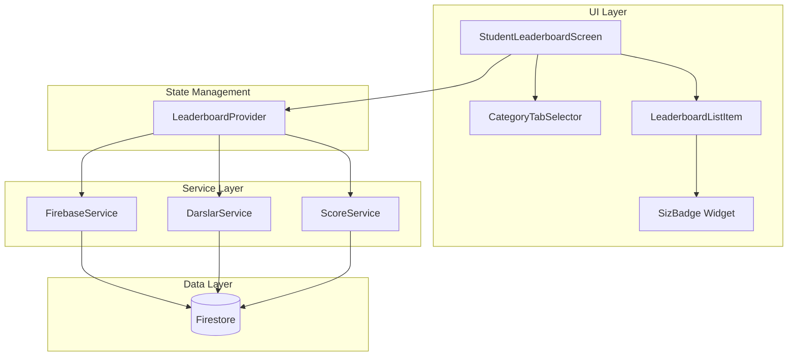
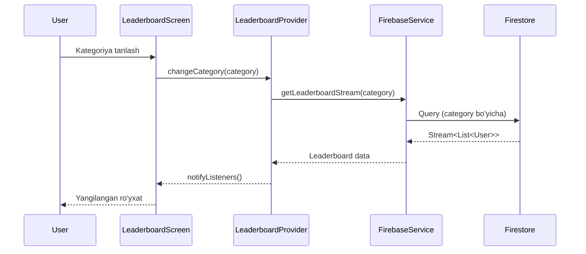

# Design Document: Leaderboard Screen Enhancement

## Overview

Ushbu dizayn hujjati Peshqadamlar (Leaderboard) ekranini yaxshilash uchun texnik yechimlarni taqdim etadi. Asosiy maqsad - foydalanuvchilarga turli mezonlar (yulduzlar, davomat, o'rtacha ball) bo'yicha reytingni ko'rish imkoniyatini berish va "SIZ" belgisini zamonaviy dizayn bilan yangilash.

### Asosiy Xususiyatlar

1. **Kategoriya Tanlash Komponenti** - TabBar yordamida uchta kategoriya o'rtasida almashish
2. **Yangi Firebase Streamlar** - Davomat va o'rtacha ball uchun real-time ma'lumotlar
3. **Yaxshilangan SIZ Belgisi** - Gradient, soya va pulsatsiya animatsiyasi
4. **Silliq O'tishlar** - Kategoriyalar o'rtasida animatsiyali o'tish

### Texnologiyalar

- **Flutter** - UI framework
- **Firebase Firestore** - Real-time ma'lumotlar bazasi
- **Provider** - State management
- **AnimationController** - Animatsiyalar uchun

## Architecture

### Komponent Diagrammasi



### Ma'lumot Oqimi



## Components and Interfaces

### 1. LeaderboardCategory Enum

```dart
/// Peshqadamlar kategoriyalari
enum LeaderboardCategory {
  stars,      // Yulduzlar bo'yicha
  attendance, // Davomat bo'yicha
  averageScore, // O'rtacha ball bo'yicha
}
```

### 2. CategoryTabSelector Widget

Kategoriyalarni tanlash uchun TabBar komponenti.

```dart
class CategoryTabSelector extends StatelessWidget {
  final LeaderboardCategory selectedCategory;
  final ValueChanged<LeaderboardCategory> onCategoryChanged;
  
  // Uchta tab: Yulduzlar, Davomat, O'rtacha Ball
  // Tanlangan tab gradient fon bilan ajratiladi
  // Animatsiyali o'tish TabController orqali
}
```

**Interfeys:**
- `selectedCategory` - Hozirgi tanlangan kategoriya
- `onCategoryChanged` - Kategoriya o'zgarganda callback

### 3. SizBadge Widget

Joriy foydalanuvchini ko'rsatuvchi yaxshilangan belgi.

```dart
class SizBadge extends StatefulWidget {
  final bool animate; // Pulsatsiya animatsiyasini yoqish/o'chirish
  
  // Gradient: duoBlue -> duoPurple
  // BoxShadow: yumshoq ko'k soya
  // Pulsatsiya: scale 1.0 -> 1.1 -> 1.0 (2 soniya sikl)
}
```

**Dizayn Spetsifikatsiyasi:**
- Gradient: `LinearGradient(colors: [AppColors.duoBlue, AppColors.duoPurple])`
- Soya: `BoxShadow(color: AppColors.duoBlue.withOpacity(0.4), blurRadius: 8, spreadRadius: 2)`
- Pulsatsiya: `AnimationController` bilan `Curves.easeInOut`, 2000ms davomiylik
- Border radius: 20px
- Padding: horizontal 12px, vertical 6px

### 4. LeaderboardProvider

State management uchun Provider.

```dart
class LeaderboardProvider extends ChangeNotifier {
  LeaderboardCategory _currentCategory = LeaderboardCategory.stars;
  List<Map<String, dynamic>> _leaderboard = [];
  bool _isLoading = false;
  String? _error;
  
  // Getters
  LeaderboardCategory get currentCategory;
  List<Map<String, dynamic>> get leaderboard;
  bool get isLoading;
  String? get error;
  
  // Methods
  void changeCategory(LeaderboardCategory category);
  Stream<List<Map<String, dynamic>>> get currentStream;
  void retry();
}
```

### 5. FirebaseService Extensions

Yangi stream metodlari.

```dart
extension LeaderboardExtensions on FirebaseService {
  /// Davomat bo'yicha reyting stream
  /// Har bir o'quvchi uchun attendancePercentage hisoblanadi
  Stream<List<Map<String, dynamic>>> getAttendanceLeaderboardStream();
  
  /// O'rtacha ball bo'yicha reyting stream
  /// ScoreService.computeScore() natijasiga asoslangan
  Stream<List<Map<String, dynamic>>> getAverageScoreLeaderboardStream();
}
```

### 6. LeaderboardListItem Widget

Har bir o'quvchi uchun ro'yxat elementi.

```dart
class LeaderboardListItem extends StatelessWidget {
  final Map<String, dynamic> user;
  final int rank;
  final bool isCurrentUser;
  final LeaderboardCategory category;
  
  // Kategoriyaga qarab turli ma'lumotlarni ko'rsatadi:
  // - stars: yulduzlar soni (⭐ 150)
  // - attendance: foiz (📅 95%)
  // - averageScore: ball (📊 87)
}
```

## Data Models

### LeaderboardEntry Model

```dart
class LeaderboardEntry {
  final String id;
  final String fullName;
  final String? avatarUrl;
  final int totalStars;
  final double attendancePercentage;
  final int averageScore;
  
  factory LeaderboardEntry.fromFirestore(Map<String, dynamic> data) {
    return LeaderboardEntry(
      id: data['id'] ?? '',
      fullName: data['fullName'] ?? data['name'] ?? 'Noma\'lum',
      avatarUrl: data['avatarUrl'],
      totalStars: data['totalStars'] ?? 0,
      attendancePercentage: (data['attendancePercentage'] ?? 0.0).toDouble(),
      averageScore: data['averageScore'] ?? 0,
    );
  }
}
```

### Firestore Ma'lumotlar Strukturasi

**users collection:**
```json
{
  "id": "user123",
  "fullName": "Ali Valiyev",
  "role": "student",
  "avatarUrl": "https://...",
  "totalStars": 150,
  "attendancePercentage": 95.5,
  "averageScore": 87
}
```

**Davomat hisoblash formulasi:**
```
attendancePercentage = (qatnashgan_darslar / jami_darslar) * 100
```

**O'rtacha ball hisoblash formulasi (ScoreService dan):**
```
averageScore = (davomat * 0.40) + (uy_vazifa * 0.35) + (o'rganish * 0.25)
```

### Kategoriya bo'yicha Tartiblash

| Kategoriya | Tartiblash maydoni | Tartib |
|------------|-------------------|--------|
| Yulduzlar | `totalStars` | Kamayish |
| Davomat | `attendancePercentage` | Kamayish |
| O'rtacha Ball | `averageScore` | Kamayish |

Teng qiymatlar uchun ikkinchi darajali tartiblash: `fullName` (alifbo tartibida).

## Correctness Properties

*A property is a characteristic or behavior that should hold true across all valid executions of a system-essentially, a formal statement about what the system should do. Properties serve as the bridge between human-readable specifications and machine-verifiable correctness guarantees.*

**Property Reflection:**

Prework tahlilidan keyin quyidagi xususiyatlar aniqlandi:

- 2.1, 3.1, 4.1 - Barcha kategoriyalar uchun tartiblash xususiyati bitta umumiy xususiyatga birlashtirilishi mumkin
- 2.3, 3.4, 4.4 - Teng qiymatlar uchun ikkinchi darajali tartiblash bitta xususiyatga birlashtirilishi mumkin
- 2.2, 3.2, 4.2 - Har bir kategoriya uchun tegishli qiymatni ko'rsatish bitta xususiyatga birlashtirilishi mumkin

### Property 1: Kategoriya bo'yicha tartiblash

*For any* o'quvchilar ro'yxati va *for any* tanlangan kategoriya (yulduzlar, davomat, o'rtacha ball), peshqadamlar ro'yxati shu kategoriyaning qiymati bo'yicha kamayish tartibida tartiblangan bo'lishi kerak.

**Validates: Requirements 2.1, 3.1, 4.1**

### Property 2: Teng qiymatlar uchun alifbo tartibi

*For any* ikkita o'quvchi bir xil kategoriya qiymatiga ega bo'lsa (yulduzlar, davomat yoki o'rtacha ball), ular ism bo'yicha alifbo tartibida ko'rsatilishi kerak.

**Validates: Requirements 2.3, 3.4, 4.4**

### Property 3: Kategoriyaga mos qiymat ko'rsatish

*For any* o'quvchi va *for any* tanlangan kategoriya, ro'yxat elementi shu kategoriyaga tegishli qiymatni (yulduzlar soni, davomat foizi, yoki o'rtacha ball) ko'rsatishi kerak.

**Validates: Requirements 2.2, 3.2, 4.2**

### Property 4: Kategoriya tanlash vizual aks etishi

*For any* kategoriya tanlanganda, tanlangan kategoriya vizual ravishda boshqalardan ajratib ko'rsatilishi kerak (gradient fon, rang o'zgarishi).

**Validates: Requirements 1.3**

## Error Handling

### Xato Turlari va Qayta Ishlash

| Xato Turi | Sabab | Foydalanuvchi Xabari | Qayta Ishlash |
|-----------|-------|---------------------|---------------|
| `NetworkError` | Internet ulanishi yo'q | "Internet ulanishini tekshiring" | Qayta urinish tugmasi |
| `FirebaseException` | Firestore xatosi | "Ma'lumotlarni yuklashda xato" | Qayta urinish tugmasi |
| `TimeoutException` | So'rov vaqti tugadi | "Ulanish vaqti tugadi" | Qayta urinish tugmasi |
| `EmptyData` | Ma'lumot yo'q | "Hozircha ma'lumot yo'q" | Bo'sh holat UI |

### Xato Holati UI

```dart
class LeaderboardErrorState extends StatelessWidget {
  final String message;
  final VoidCallback onRetry;
  
  // Icon: warning_amber_rounded (64px)
  // Xabar: 16px, w600
  // Qayta urinish tugmasi: GamifiedButton
}
```

### Default Qiymatlar

- Davomat ma'lumotlari yo'q bo'lsa: `0%`
- O'rtacha ball ma'lumotlari yo'q bo'lsa: `0`
- Yulduzlar ma'lumotlari yo'q bo'lsa: `0`
- Ism yo'q bo'lsa: `"Noma'lum"`

## Testing Strategy

### Unit Testlar

**Tartiblash Logikasi:**
- `sortByStars()` - yulduzlar bo'yicha tartiblash
- `sortByAttendance()` - davomat bo'yicha tartiblash
- `sortByAverageScore()` - o'rtacha ball bo'yicha tartiblash
- `secondarySort()` - teng qiymatlar uchun alifbo tartibi

**Default Qiymatlar:**
- Null davomat → 0%
- Null o'rtacha ball → 0
- Null yulduzlar → 0

### Widget Testlar

**CategoryTabSelector:**
- Uchta tab mavjudligi
- Default tanlangan tab (Yulduzlar)
- Tab almashish callback

**SizBadge:**
- Gradient mavjudligi
- Soya mavjudligi
- Pulsatsiya animatsiyasi
- Light/Dark theme mosligi

**LeaderboardListItem:**
- Kategoriyaga mos qiymat ko'rsatish
- Rank ko'rsatish (1, 2, 3 uchun maxsus ikonlar)
- SizBadge joriy foydalanuvchi uchun

### Integration Testlar

**Firebase Streamlar:**
- `getAttendanceLeaderboardStream()` - to'g'ri ma'lumot qaytarishi
- `getAverageScoreLeaderboardStream()` - to'g'ri ma'lumot qaytarishi
- Stream xatolarini qayta ishlash

### Property-Based Testlar

**Test Konfiguratsiyasi:**
- Minimum 100 iteratsiya
- fast_check kutubxonasi (Dart)

**Property 1 Test:**
```dart
// Feature: leaderboard-enhancement, Property 1: Kategoriya bo'yicha tartiblash
// For any list of students and any category, the leaderboard should be sorted
// by that category's value in descending order
```

**Property 2 Test:**
```dart
// Feature: leaderboard-enhancement, Property 2: Teng qiymatlar uchun alifbo tartibi
// For any two students with equal category values, they should be ordered
// alphabetically by name
```

**Property 3 Test:**
```dart
// Feature: leaderboard-enhancement, Property 3: Kategoriyaga mos qiymat ko'rsatish
// For any student and any category, the list item should display the
// corresponding value for that category
```

**Property 4 Test:**
```dart
// Feature: leaderboard-enhancement, Property 4: Kategoriya tanlash vizual aks etishi
// For any category selection, the selected tab should have distinct visual styling
```

### Test Fayllari Strukturasi

```
test/
├── unit/
│   ├── leaderboard_sorting_test.dart
│   └── leaderboard_defaults_test.dart
├── widget/
│   ├── category_tab_selector_test.dart
│   ├── siz_badge_test.dart
│   └── leaderboard_list_item_test.dart
├── integration/
│   └── firebase_leaderboard_streams_test.dart
└── property/
    └── leaderboard_properties_test.dart
```

