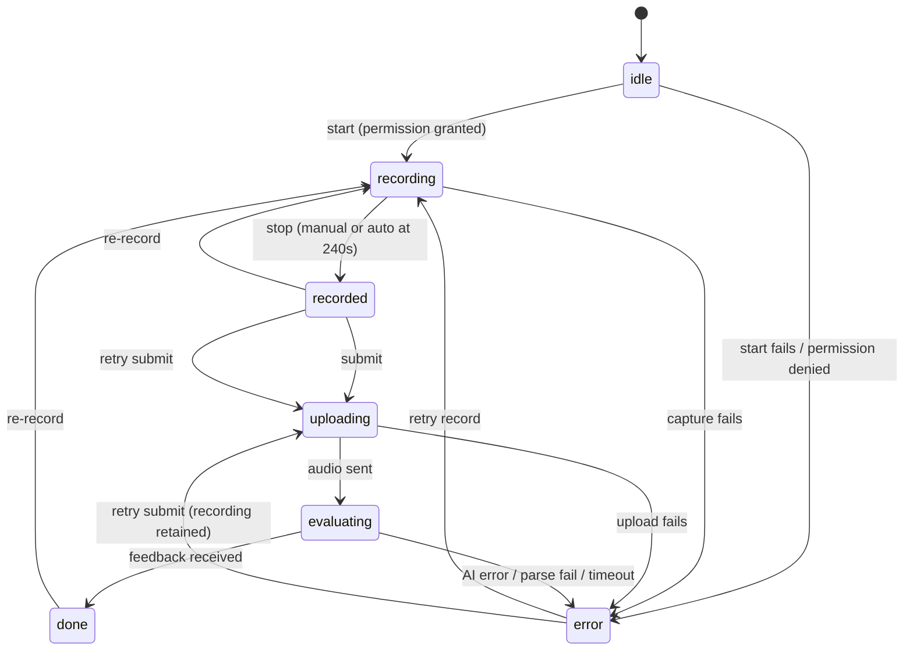

# Design Document

## Overview

This feature adds per-Aufgabe audio recording, playback, and AI evaluation to the Sprechen section of the Berlin-Nukus app. A learner records spoken German (up to 240 seconds) for an individual speaking task, plays it back to confirm it, then submits the finished audio to Google Gemini for evaluation. Gemini understands audio natively, so the recorded file is sent directly (no separate speech-to-text step) and Gemini returns structured feedback including an AI-generated score.

The design follows patterns already established in the codebase:

- **Worker proxy pattern** — all secrets live in the Cloudflare Worker (`proxy-worker/index.js`); the app posts to `CF_WORKER_URL` with `X-App-Token` and an `X-Proxy-Target` header. We add a new target `gemini-audio` that calls the Gemini `generateContent` endpoint (the existing OpenAI-compatible chat path does not cleanly carry inline audio).
- **Service-layer pattern** — `AIService`, `TTSService`, and `CloudinaryService` are static/instance service classes under `lib/services/`. We add `AudioRecorderService` and `SprechenEvaluationService` there.
- **Web vs native conditional imports** — mirrors `web_blob_url.dart` (`export ... if (dart.library.html) ...`) used by `TTSService`.
- **Evaluation UX precedent** — `schreiben_screen.dart` (loading spinner on submit, `_buildEvaluationCard`, error `SnackBar`) is mirrored for the audio result card. The collapsible `_SampleAnswerPanel` in `sprechen_teil_screen.dart` is mirrored for the feedback panel.
- **Localization** — the `_t({uz, kaa, ru, de})` helper in `app_localizations.dart` with its `_code → uz → first` fallback.

This feature touches only the two currently available Teile and does not alter existing Sprechen content.

### Key Decisions (from approved requirements)

| Decision | Choice |
| --- | --- |
| AI provider | Google Gemini, direct audio input via `generateContent` + `inlineData` |
| Transport | Inline base64 through the Worker (no Cloudinary for the default path) |
| Persistence | None — feedback and recordings are session-scoped; temp files deleted after evaluation |
| Score | Generated by Gemini and rendered as returned |
| Recording limit | 240 s, per-Aufgabe, one active recording at a time |

---

## Architecture

```mermaid
flowchart TD
    subgraph UI["sprechen_teil_screen.dart"]
        Card["_buildAufgabeCard (per Aufgabe)"]
        RC["RecordingControl widget<br/>(keyed by Aufgabe identity)"]
        FB["Feedback panel<br/>(mirrors _SampleAnswerPanel)"]
        Card --> RC
        Card --> FB
    end

    subgraph Services["lib/services/"]
        ARS["AudioRecorderService<br/>(record pkg, native+web)"]
        SES["SprechenEvaluationService"]
        PB["audioplayers (playback)"]
    end

    subgraph Platform["conditional imports"]
        Native["native: AAC/m4a temp file"]
        Web["web: opus/webm blob"]
    end

    RC -->|start/stop/timer| ARS
    RC -->|play/pause| PB
    RC -->|submit base64 + context| SES
    ARS --> Native
    ARS --> Web

    SES -->|POST X-Proxy-Target: gemini-audio<br/>{model, audioBase64, mimeType, prompt}| Worker

    subgraph CF["Cloudflare Worker (proxy-worker/index.js)"]
        Worker["handleGeminiAudio()<br/>(new handler)"]
        Token["X-App-Token check + CORS + rate limit"]
        Token --> Worker
    end

    Worker -->|generateContent + inlineData<br/>+ GEMINI_API_KEY| Gemini["Gemini API<br/>generativelanguage.googleapis.com"]
    Gemini -->|JSON: score + category feedback| Worker
    Worker --> SES
    SES -->|AudioEvaluation| RC
```

### Request flow

1. Learner taps record on an Aufgabe's `RecordingControl`. `AudioRecorderService` checks/requests mic permission via `permission_handler`, then starts capture. Any other Aufgabe currently recording is stopped first (one-active-recording rule).
2. A 1 Hz timer updates `elapsedSeconds`; at 240 s the recorder auto-stops.
3. On stop, the recorder produces an `Audio_Recording` (native: temp file path; web: blob URL + bytes). The control shows playback (`audioplayers`) and submit actions.
4. On submit, `SprechenEvaluationService` reads the audio bytes, base64-encodes them, builds the prompt from Aufgabe context, and POSTs to the Worker with `X-Proxy-Target: gemini-audio`.
5. The Worker injects `GEMINI_API_KEY`, calls Gemini `generateContent` with `inlineData`, and returns Gemini's JSON.
6. `SprechenEvaluationService` parses the structured JSON into an `AudioEvaluation`. The control displays the feedback panel and (optionally) deletes the temp file.
7. Leaving the screen discards all in-memory state; nothing is persisted.

---

## Components and Interfaces

### 1. AudioRecorderService (`lib/services/audio_recorder_service.dart`)

Wraps the `record` package (to be added to `pubspec.yaml`). Owns a single `AudioRecorder` instance and enforces the one-active-recording rule. Native and web differences are isolated behind conditional imports, mirroring `web_blob_url.dart`.

```dart
class AudioRecorderService {
  // Singleton-ish: one recorder instance shared across all controls so only
  // one Aufgabe can record at a time (Requirement 3.5).
  Future<bool> hasPermission();              // permission_handler
  Future<PermissionResult> requestPermission();
  Future<void> start();                      // begins capture; throws on failure
  Future<RecordedAudio> stop();              // returns file/blob + mimeType
  Future<void> cancel();                     // discards in-progress capture
  Stream<int> get elapsed;                   // emits elapsed seconds (>=1 Hz)
  Future<void> dispose();
  static bool get isSupportedPlatform;       // false if recording unavailable
}
```

- **Format**: native → AAC in an `.m4a` container (`AudioEncoder.aacLc`), 16 kHz mono, ~24–32 kbps (speech-optimized, small size). Web → `AudioEncoder.opus` in a WebM container (browser native). Both decode cleanly in Gemini.
- **File path (native)**: `path_provider`-style temp dir; one file per active recording, named by Aufgabe key. The `record` package returns the path from `stop()`.
- **Web**: `record` returns a blob URL; bytes are read for both playback (via `audioplayers` `UrlSource(blobUrl)`) and submission.
- **Timer / auto-stop**: an internal `Timer.periodic(1s)` increments elapsed and calls `stop()` at `Max_Recording_Duration = 240`. The control distinguishes a manual stop from an auto-stop to show the "max length reached" message.
- **Permission**: `permission_handler` `Permission.microphone`. Returns a result enum so the UI can branch on granted / denied / permanently denied (`openAppSettings()`).
- **Cleanup**: `deleteRecording(path)` removes the temp file after a successful evaluation and on re-record/screen exit.

### 2. SprechenEvaluationService (`lib/services/sprechen_evaluation_service.dart`)

Static service mirroring `AIService` conventions (reads `CF_WORKER_URL` / `APP_TOKEN`, posts via `http`, 60 s timeout for audio).

```dart
class SprechenEvaluationService {
  static Future<AudioEvaluation> evaluate({
    required Uint8List audioBytes,
    required String mimeType,        // 'audio/mp4' (native) | 'audio/webm' (web)
    required SprechenAufgabe aufgabe,
    required String level,           // e.g. 'B1'
    required String uiLangCode,      // uz/kaa/ru/de → feedback language
  });
}
```

Responsibilities:
- Build the evaluation prompt from `aufgabe.instruction`, `aufgabe.meinung`, `aufgabe.partner`, `aufgabe.title`, and the target feedback language.
- Base64-encode the audio and POST `{model, audioBase64, mimeType, prompt}` to the Worker with `X-Proxy-Target: gemini-audio`.
- Parse Gemini's structured JSON into `AudioEvaluation`, reusing an `_extractJson`-style tolerant parser (Gemini may wrap JSON in markdown fences, as `AIService` already handles).
- Map HTTP/timeout/parse failures to typed errors the UI can localize.

### 3. Cloudflare Worker — new `gemini-audio` target (`proxy-worker/index.js`)

Add a branch in the existing `switch (target)` and a `handleGeminiAudio` function. It does NOT use the OpenAI-compatible chat URL; it calls the native Gemini endpoint that supports `inlineData`.

```js
case "gemini-audio":
  return await handleGeminiAudio(request, env, cors);

async function handleGeminiAudio(request, env, cors) {
  const apiKey = env.GEMINI_API_KEY;
  if (!apiKey) return json({ error: "GEMINI_API_KEY topilmadi" }, 500, cors);

  const { model, audioBase64, mimeType, prompt } = await request.json();
  const m = model || env.GEMINI_AUDIO_MODEL || "gemini-2.5-flash";

  const url =
    `https://generativelanguage.googleapis.com/v1beta/models/${m}:generateContent`;

  const upstream = await fetch(url, {
    method: "POST",
    headers: { "Content-Type": "application/json", "x-goog-api-key": apiKey },
    body: JSON.stringify({
      contents: [{
        role: "user",
        parts: [
          { text: prompt },
          { inlineData: { mimeType: mimeType, data: audioBase64 } },
        ],
      }],
      generationConfig: { temperature: 0.3, responseMimeType: "application/json" },
    }),
  });

  const respBody = await upstream.text();
  return new Response(respBody, {
    status: upstream.status,
    headers: { ...cors, "Content-Type": "application/json" },
  });
}
```

Notes:
- The existing `X-App-Token` check, CORS handling (`corsHeaders` already reflects custom request headers), and `RATE_LIMITER` binding apply automatically because they run before the `switch`. The preflight `Access-Control-Allow-Headers` already echoes requested headers, so no `Content-Type`/`X-Proxy-Target` change is needed.
- `responseMimeType: "application/json"` asks Gemini to emit raw JSON, reducing markdown-fence parsing risk.
- Model is configurable via `GEMINI_AUDIO_MODEL` (separate from the chat `GEMINI_MODEL`).

### 4. RecordingControl widget (in `sprechen_teil_screen.dart` or a new private widget file)

A `StatefulWidget` appended inside `_buildAufgabeCard`, after the sample-answer panel. It renders the state-machine UI (record / stop+timer / playback+re-record+submit / evaluating / feedback). It is keyed by Aufgabe identity so each Aufgabe (including Kandidat A/B and each test) keeps independent state. The parent screen holds a coordinator so that starting one recording stops any other.

### 5. Playback (audioplayers)

Reuses the existing `audioplayers` dependency. Native plays the temp file path (`DeviceFileSource`); web plays the blob URL (`UrlSource`), exactly as `TTSService` does for web blobs. Playback stops on re-record (Requirement 5.4).

---

## Data Models

All models are **ephemeral** (in-memory only, discarded on screen exit — Requirement 7.6). They live in `lib/screens/student/sprechen/sprechen_recording_models.dart`.

### Aufgabe identity key

Recording state must be keyed so Kandidat A and B, and each test, are independent (Requirements 1.2, 1.4, 3.5).

```dart
class AufgabeKey {
  final int teilNumber;   // widget.teil.teilNumber
  final int testIndex;    // _currentTest (0 for single-test Teile)
  final int aufgabeIndex; // index within _currentAufgaben
  // value equality (== / hashCode) so it can be a Map key
}
```

### RecordingPhase

```dart
enum RecordingPhase { idle, recording, recorded, uploading, evaluating, done, error }
```

State transitions:



### SprechenRecordingState (per Aufgabe)

```dart
class SprechenRecordingState {
  final RecordingPhase phase;
  final int elapsedSeconds;        // during recording
  final String? filePathOrBlobUrl; // recorded audio location
  final String? mimeType;          // 'audio/mp4' | 'audio/webm'
  final bool reachedMaxLength;     // true if auto-stopped at 240s
  final AudioEvaluation? feedback; // when phase == done
  final SprechenError? error;      // when phase == error
}
```

### AudioEvaluation (result)

Parsed from Gemini's structured JSON. Score is whatever Gemini returns; scale is rendered as given.

```dart
class AudioEvaluation {
  final String score;          // e.g. "16/20" or "B1 erreicht" — AI-generated
  final String pronunciation;  // category commentary
  final String fluency;
  final String grammar;
  final String content;        // relevance to the task
  final String overall;        // summary text
}
```

Expected Gemini JSON shape (requested via prompt + `responseMimeType`):

```json
{
  "score": "16/20",
  "pronunciation": "…",
  "fluency": "…",
  "grammar": "…",
  "content": "…",
  "overall": "…"
}
```

### SprechenError (typed)

```dart
enum SprechenErrorType {
  recordStartFailed, recordingFailed, micDenied, micPermanentlyDenied,
  unsupportedPlatform, uploadFailed, evaluationFailed, timeout, parseError
}
class SprechenError { final SprechenErrorType type; final String? detail; }
```

Each type maps to a localized message (see Localization and Error Handling).

---

## Correctness Properties

*A property is a characteristic or behavior that should hold true across all valid executions of a system — essentially, a formal statement about what the system should do. Properties serve as the bridge between human-readable specifications and machine-verifiable correctness guarantees.*

Most of this feature is UI interaction, plugin integration (`record`, `permission_handler`, `audioplayers`), and an external AI call — those are covered by example, edge-case, and integration tests in the Testing Strategy. The properties below target the **pure, input-varying logic**: the per-Aufgabe state coordinator, the submit guards, prompt construction, response parsing, localization resolution, and the timer model. Each is implemented as a single property-based test running at least 100 iterations.

### Property 1: State isolation across distinct Aufgaben

*For any* map of recording states keyed by `AufgabeKey` and *any* single-key state transition, every other key's state remains unchanged, and two distinct Aufgaben (including Kandidat A vs B and Aufgaben in different tests) always produce distinct, non-colliding keys.

**Validates: Requirements 1.2, 1.4**

### Property 2: At most one active recording

*For any* sequence of start-recording actions applied to random `AufgabeKey`s through the recording coordinator, after each action at most one Aufgabe is in the `recording` phase.

**Validates: Requirements 3.5**

### Property 3: Submit only with a completed recording

*For any* `RecordingPhase`, the submit action is enabled if and only if a completed recording exists for that Aufgabe (phase is `recorded`, `done`, or `error` with a retained recording), and is never enabled while the phase is `idle` or `recording`.

**Validates: Requirements 6.2**

### Property 4: No concurrent submission of the same Aufgabe

*For any* Aufgabe whose phase is `uploading` or `evaluating`, invoking submit again initiates no additional evaluation request (the guard is idempotent for in-flight submissions).

**Validates: Requirements 6.6**

### Property 5: Prompt carries Aufgabe context

*For any* `SprechenAufgabe`, the evaluation request built by `SprechenEvaluationService` contains the task instruction, and includes the Meinung text and partner role whenever those fields are present (non-empty) on the Aufgabe.

**Validates: Requirements 6.4**

### Property 6: Evaluation response round-trip

*For any* valid `AudioEvaluation`, serializing it to the expected Gemini JSON shape and parsing it back yields an equivalent `AudioEvaluation` with the score and all category fields (pronunciation, fluency, grammar, content, overall) preserved.

**Validates: Requirements 7.2, 7.3**

### Property 7: Response parser is total and safe

*For any* arbitrary input string (including garbage, empty, and malformed or partial JSON), the response parser either returns a complete `AudioEvaluation` with all required fields populated, or raises a typed `SprechenError(parseError)` — it never throws an unhandled exception and never returns an object with missing required fields.

**Validates: Requirements 8.4**

### Property 8: Localization resolution and fallback

*For any* supported locale code (uz, kaa, ru, de) and *any* localization key map, the `_t` resolver returns the entry for that locale when present; otherwise it falls back to the `uz` entry, and otherwise to the first available entry.

**Validates: Requirements 7.4, 10.3**

### Property 9: Platform-agnostic request building

*For any* supported MIME type (`audio/mp4` for native, `audio/webm` for web) and *any* audio byte buffer, the request built for submission carries that exact MIME type and an `audioBase64` field equal to the base64 encoding of the bytes — independent of platform.

**Validates: Requirements 9.3**

### Property 10: Timer remaining-time invariant and max-duration bound

*For any* elapsed value in the range 0..240, the displayed remaining time equals `Max_Recording_Duration - elapsed` and stays within `[0, 240]`; recording auto-stops exactly at 240 seconds so the final elapsed value never exceeds the maximum.

**Validates: Requirements 4.2, 4.4**

---

## Error Handling

All errors surface as a typed `SprechenError` that the UI maps to a localized message. The control returns to a sensible phase so the learner can recover.

| Condition | Requirement | `SprechenErrorType` | UI behavior | Recording retained? |
| --- | --- | --- | --- | --- |
| Recorder fails to start | 8.1 | `recordStartFailed` | SnackBar/error text, return to `idle` | n/a |
| Recorder fails mid-capture | 8.2 | `recordingFailed` | Error text, discard partial file, return to `idle` | No (discarded) |
| Mic permission denied | 2.3 | `micDenied` | Localized "mic required" message | n/a |
| Mic permanently denied | 2.4 | `micPermanentlyDenied` | Message + "Open settings" action (`openAppSettings()`) | n/a |
| Platform unsupported | 9.4 | `unsupportedPlatform` | "Recording unavailable" message, hide controls | n/a |
| Upload/transport fails | 8.3 | `uploadFailed` | Localized network error + Retry button | Yes |
| Gemini returns error/unparseable | 8.4 | `evaluationFailed` / `parseError` | Localized evaluation error + Retry | Yes |
| No response before timeout | 8.5 | `timeout` | Localized timeout message + Retry | Yes |

Implementation notes:
- The `SprechenEvaluationService` uses a 60 s `http` timeout (audio is heavier than text; the existing `AIService` chat timeout is 30 s). On `TimeoutException` it raises `SprechenError(timeout)`.
- Non-2xx Worker responses → `uploadFailed`/`evaluationFailed` depending on whether the failure is transport (network, 5xx) or Gemini-side (4xx with an error body), parsed from the response.
- The parser tolerates Gemini wrapping JSON in markdown fences (reusing the `_extractJson` approach already in `AIService`). If extraction or field validation fails → `parseError`; the recording is retained (state moves to `error`, not `idle`) so the learner can resubmit (Requirement 8.4).
- All temp files are deleted on successful evaluation, on re-record, and on screen `dispose()` — even on the error paths that discard recordings.

### Security and cost note

- No secrets are added to the app. `GEMINI_API_KEY` stays in the Worker. The new path inherits the existing `X-App-Token` gate and `RATE_LIMITER` binding, so it is not an open proxy.
- Audio is sent over HTTPS to the Worker and never persisted server-side or client-side beyond the session.

---

## Transport Decision (inline base64 vs Cloudinary)

**Decision: send audio inline as base64 through the Worker to Gemini `generateContent` (`inlineData`).** Do not use Cloudinary on the default path.

Rationale and sizing:
- A 240 s recording at speech-optimized AAC ~24–32 kbps mono is roughly **0.7–1.0 MB** (the 2–4 MB figure assumes higher bitrates; speech mono at low bitrate is smaller). Base64 inflates by ~33%, giving roughly **1–1.4 MB** on the wire — well within practical request limits.
- Gemini's `generateContent` supports inline audio via `inlineData`; the documented inline-request ceiling is on the order of ~20 MB total request size, which our payload stays far below. The Cloudflare Worker streams the request body, so the inline approach avoids a second network hop and an extra third-party dependency.
- Inline keeps the design simpler and matches "no persistence" — nothing is stored anywhere, even transiently in Cloudinary.

**Fallback (documented, not default):** if a recording ever exceeds a safe inline threshold (configurable, default ~12 MB base64), the app can upload to Cloudinary (`CloudinaryService.uploadRawFile`) and pass the URL to Gemini via `fileData`/file URI instead of `inlineData`. Given the 240 s speech-mono budget this path is not expected to trigger, but the threshold check and Cloudinary fallback are included for safety. The `record` encoder settings (mono, low bitrate) are chosen specifically to keep payloads inline-friendly.

---

## Gemini Model Choice and Rate Limits

- **Model**: configurable via a new Worker env var `GEMINI_AUDIO_MODEL`, defaulting to `gemini-2.5-flash`. This is separate from the chat `GEMINI_MODEL` so audio evaluation can be tuned independently.
- **Shared free-tier daily caps** (per project/API key, shared across all app users; reset midnight Pacific): Gemini 2.5 Flash ≈ 250 RPD, Flash-Lite ≈ 1000 RPD, Pro ≈ 100 RPD. Audio is billed as ordinary request tokens (~32 tokens/sec of audio), so a 240 s clip is a small token cost — the binding constraint is the **daily request count**, not tokens.
- **Recommendation**: for production with many concurrent learners, enable billing (paid tier removes the restrictive daily cap at very low audio cost). If staying on free tier, use Flash-Lite (`gemini-2.5-flash-lite`) for the higher ~1000 RPD allowance.
- **Throttling**: the Worker's existing per-IP `RATE_LIMITER` already applies. Optionally add a Worker-side daily counter (e.g. a Durable Object or KV counter keyed by date) to fail fast with a localized "try later" message before hitting Gemini's hard cap. A per-session client-side submission cap is a lightweight alternative.

---

## Localization Plan

New keys are added to `app_localizations.dart` using the existing `_t({uz, kaa, ru, de})` pattern, grouped with the other `sprechen*` keys. Every key MUST define all four locales (uz, kaa, ru, de); the `_t` fallback (`code → uz → first`) handles any gap (Requirement 10.3). Proposed keys:

| Key | Purpose | Req |
| --- | --- | --- |
| `sprechenRecord` | "Record" button label | 3.1 |
| `sprechenStop` | "Stop" button label | 3.2 |
| `sprechenReRecord` | "Re-record" action | 3.4 |
| `sprechenPlay` | "Play" playback action | 5.1 |
| `sprechenPause` | "Pause" action | 5.3 |
| `sprechenSubmit` | "Submit for evaluation" | 6.1 |
| `sprechenEvaluating` | In-progress indicator label | 6.5 |
| `sprechenRecording` | "Recording…" status | 3.2 |
| `sprechenMaxLengthReached` | Max-length auto-stop message | 4.3 |
| `sprechenRemaining` | Remaining-time label/format | 4.4 |
| `sprechenMicPermissionDenied` | Mic access required | 2.3 |
| `sprechenMicPermissionSettings` | Offer to open app settings | 2.4 |
| `sprechenRecordingUnavailable` | Platform unsupported message | 9.4 |
| `sprechenUploadError` | Network/upload error + retry | 8.3 |
| `sprechenEvaluationError` | AI/parse error + retry | 8.4 |
| `sprechenTimeoutError` | Timeout message + retry | 8.5 |
| `sprechenRetry` | "Retry" button | 8.3, 8.4, 8.5 |
| `sprechenFeedbackTitle` | Feedback panel header | 7.1 |
| `sprechenScore` | "Score" label | 7.3 |
| `sprechenPronunciation` | Pronunciation category label | 7.2 |
| `sprechenFluency` | Fluency category label | 7.2 |
| `sprechenGrammar` | Grammar category label | 7.2 |
| `sprechenContent` | Content/relevance category label | 7.2 |
| `sprechenOverall` | Overall summary label | 7.2 |

The feedback **content** itself is generated by Gemini in the learner's selected language: `SprechenEvaluationService` passes `uiLangCode` and the prompt instructs Gemini to respond in that language (uz/kaa/ru/de), satisfying Requirement 7.4 for the AI-produced text while the labels above cover the static UI.

---

## Platform Handling (Native vs Web)

Mirror the existing `web_blob_url.dart` conditional-import split so the app compiles on both native and web without `dart:io`/`dart:html` leaking across platforms.

```
audio_recorder_platform.dart          // export ... if (dart.library.html) ...
audio_recorder_platform_stub.dart     // native: file path, audio/mp4, dart:io temp dir
audio_recorder_platform_web.dart      // web: blob URL, audio/webm, reads bytes
```

- The `record` package itself supports both native and web; the split is for reading bytes for submission and for choosing the MIME type/encoder.
- Native: recording goes to a temp file (`getTemporaryDirectory()`-style path); submission reads the file bytes; playback uses `DeviceFileSource(path)`.
- Web: recording yields a blob URL; submission reads bytes from the blob; playback uses `UrlSource(blobUrl)` exactly as `TTSService` does. Blob URLs are revoked on dispose/re-record (mirroring `revokeBlobUrl`).
- `AudioRecorderService.isSupportedPlatform` returns false when neither path can initialize, driving the Requirement 9.4 "unavailable" message.

---

## Testing Strategy

A dual approach: example/widget/integration tests for UI and plugin behavior, and property-based tests for the pure logic enumerated in Correctness Properties.

### Property-based tests

- **Library**: use a Dart property-testing library (e.g. `glados`) added under `dev_dependencies`. Do not hand-roll property testing.
- **Iterations**: each property test runs at least **100 iterations**.
- **Tagging**: each test is tagged with a comment referencing its design property, format:
  `// Feature: sprechen-audio-recording, Property {number}: {property text}`
- Implement each of the 10 correctness properties with a single property-based test:
  - Generators: `AufgabeKey`s (teil/test/aufgabe indices), `SprechenAufgabe`s (random instruction/meinung/partner), `RecordingPhase`s, `AudioEvaluation`s, locale codes, MIME types, and byte buffers.
  - Property 7 (parser totality) uses arbitrary/garbage strings and malformed JSON as input.

### Unit / example tests

- State-machine transitions (start, stop, re-record, submit, error branches) — Requirements 2.x, 3.1–3.4, 5.x, 6.1/6.3/6.5, 7.1/7.5, 8.1–8.3/8.5.
- `SprechenEvaluationService` with a **mocked HTTP client**: asserts the POST uses `X-Proxy-Target: gemini-audio`, `X-App-Token`, and a base64 body; maps non-2xx and timeout to the right `SprechenError`.
- Permission branches with a mocked `permission_handler`.
- Playback calls with a mocked `audioplayers` player.
- Localization coverage: every new key defines all four locales (Requirement 10.1).
- No-persistence check: on screen dispose, temp files are deleted and no Firestore/`shared_preferences` writes occur (Requirement 7.6).

### Widget tests

- One `RecordingControl` per Aufgabe; correct controls per selected test (Requirements 1.1, 1.3).
- Phase-driven UI: stop+indicator while recording, play/submit when recorded, spinner while evaluating, feedback panel when done, error + retry on failure (Requirements 3.2, 6.1, 6.5, 7.1, 8.x).
- Locale change updates labels (Requirement 10.2).

### Integration / manual tests

- Worker `gemini-audio` path: 1–2 real calls verifying a small audio clip returns parseable structured JSON (Requirements 6.3, 6.4, 7.2).
- Manual microphone testing on a real Android device and in a browser (Requirements 9.1, 9.2) — mic capture quality and permission prompts cannot be fully automated.
