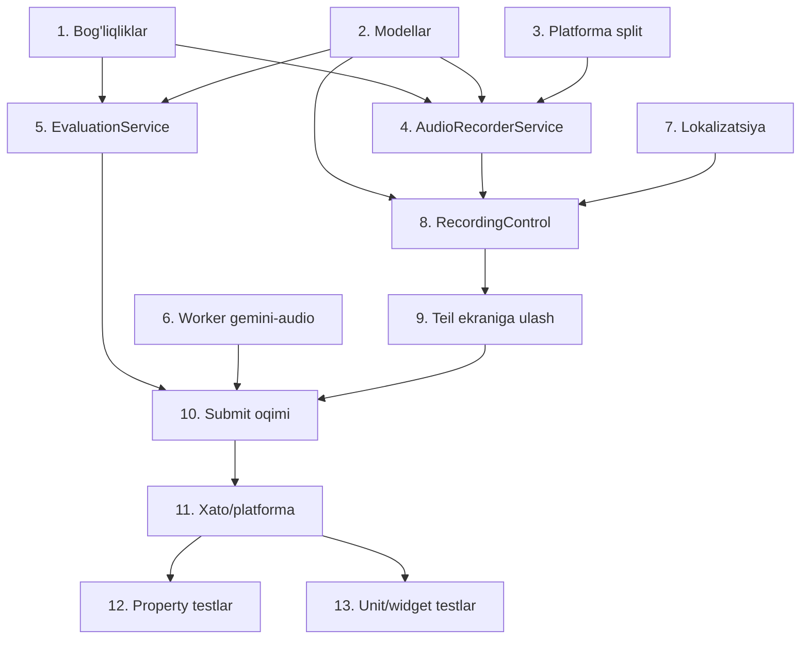

# Implementation Plan

## Overview

Bu reja Sprechen bo'limiga audio yozish + Gemini baholash funksiyasini bosqichma-bosqich qo'shadi. Avval bog'liqliklar, vaqtinchalik modellar va xizmatlar (mustaqil sinaladigan), keyin Worker yo'li va lokalizatsiya, so'ng UI ulanishi, oxirida testlar. Barcha kod patternlari mavjud kodbazaga (AIService, TTSService, web_blob_url, _SampleAnswerPanel) asoslanadi.

## Task Dependency Graph



```json
{
  "waves": [
    { "wave": 1, "tasks": ["1", "2", "3"] },
    { "wave": 2, "tasks": ["4", "5", "6", "7"] },
    { "wave": 3, "tasks": ["8"] },
    { "wave": 4, "tasks": ["9"] },
    { "wave": 5, "tasks": ["10"] },
    { "wave": 6, "tasks": ["11"] },
    { "wave": 7, "tasks": ["12", "13"] }
  ]
}
```

## Tasks

- [x] 1. Bog'liqliklarni qo'shish
  - `pubspec.yaml` ga `record` paketini qo'shish (audio yozish uchun)
  - `dev_dependencies` ga `glados` (property-based testlar uchun) qo'shish
  - `flutter pub get` ishlatib paketlar o'rnatilganini tekshirish
  - Android `AndroidManifest.xml` da `RECORD_AUDIO` ruxsati borligini tekshirish/qo'shish
  - _Requirements: 9.1, 9.2_

- [x] 2. Vaqtinchalik (ephemeral) data modellarini yaratish
  - Yangi fayl: `lib/screens/student/sprechen/sprechen_recording_models.dart`
  - `AufgabeKey` (teilNumber, testIndex, aufgabeIndex) — value equality (`==`/`hashCode`) bilan, Map kaliti sifatida ishlatish uchun
  - `RecordingPhase` enum: idle, recording, recorded, uploading, evaluating, done, error
  - `SprechenRecordingState`: phase, elapsedSeconds, filePathOrBlobUrl, mimeType, reachedMaxLength, feedback, error
  - `AudioEvaluation`: score, pronunciation, fluency, grammar, content, overall
  - `SprechenError` + `SprechenErrorType` enum (recordStartFailed, recordingFailed, micDenied, micPermanentlyDenied, unsupportedPlatform, uploadFailed, evaluationFailed, timeout, parseError)
  - _Requirements: 1.4, 7.2, 7.3, 7.6, 8.1-8.5_

- [x] 3. Platforma bo'linishi (conditional import) skeletini yaratish
  - `web_blob_url.dart` namunasiga ko'ra 3 ta fayl: `audio_recorder_platform.dart` (export ... if dart.library.html), `audio_recorder_platform_stub.dart` (native: dart:io temp dir, audio/mp4), `audio_recorder_platform_web.dart` (web: blob URL, audio/webm, baytlarni o'qish)
  - Har platformada: yozilgan audioni baytlar sifatida o'qish va MIME turini aniqlash funksiyalari
  - _Requirements: 9.1, 9.2, 9.4_

- [x] 4. AudioRecorderService yaratish
  - Yangi fayl: `lib/services/audio_recorder_service.dart`
  - `record` paketini o'rab, bitta `AudioRecorder` instansi (bir vaqtda faqat bitta yozish — Requirement 3.5)
  - `permission_handler` orqali mikrofon ruxsati: granted / denied / permanently denied (openAppSettings)
  - Native: AAC/m4a (16kHz mono, ~24-32kbps); Web: opus/webm
  - 1 Hz timer + 240 soniyada avtomatik to'xtash; manual va avtomatik to'xtashni farqlash (`reachedMaxLength`)
  - `start()`, `stop()`, `cancel()`, `elapsed` stream, `dispose()`, `isSupportedPlatform`
  - Vaqtinchalik fayllarni o'chirish (`deleteRecording`)
  - _Requirements: 2.1-2.5, 3.1-3.5, 4.1-4.4, 9.1, 9.2, 9.4_

- [x] 5. SprechenEvaluationService yaratish
  - Yangi fayl: `lib/services/sprechen_evaluation_service.dart`
  - `AIService` uslubida: `CF_WORKER_URL` + `APP_TOKEN` ni env'dan o'qish, `http` bilan POST, 60s timeout
  - Promptni Aufgabe kontekstidan qurish: instruction, meinung, partner, title + maqsad til (uz/kaa/ru/de)
  - Audio baytlarni base64'ga o'girib, `{model, audioBase64, mimeType, prompt}` ni `X-Proxy-Target: gemini-audio` bilan yuborish
  - Gemini'ning JSON javobini bardoshli (markdown-fence ham) `AudioEvaluation` ga parse qilish (`AIService._extractJson` uslubida)
  - HTTP/timeout/parse xatolarini typed `SprechenError` ga aylantirish
  - _Requirements: 6.2, 6.3, 6.4, 7.1, 7.2, 7.3, 8.3, 8.4, 8.5_

- [x] 6. Cloudflare Worker'ga `gemini-audio` yo'lini qo'shish (server-side, qo'lda deploy kerak)
  - `proxy-worker/index.js` da `switch (target)` ga `case "gemini-audio"` qo'shish
  - `handleGeminiAudio(request, env, cors)`: `generativelanguage.googleapis.com/v1beta/models/{model}:generateContent` ga `inlineData` (audioBase64) + text prompt + `responseMimeType: application/json` bilan murojaat
  - `GEMINI_API_KEY` (mavjud) va yangi `GEMINI_AUDIO_MODEL` env (default `gemini-2.5-flash`) ishlatish
  - **MANUAL QADAM (foydalanuvchi):** worker'ni `wrangler deploy` bilan qayta joylashtirish va kerak bo'lsa `GEMINI_AUDIO_MODEL` secret/var qo'shish
  - _Requirements: 6.2, 6.3, 6.4_

- [x] 7. Lokalizatsiya kalitlarini qo'shish
  - `lib/l10n/app_localizations.dart` ga 24 ta yangi `sprechen*` kalit (uz/kaa/ru/de), dizayndagi jadval bo'yicha: sprechenRecord, sprechenStop, sprechenReRecord, sprechenPlay, sprechenPause, sprechenSubmit, sprechenEvaluating, sprechenRecording, sprechenMaxLengthReached, sprechenRemaining, sprechenMicPermissionDenied, sprechenMicPermissionSettings, sprechenRecordingUnavailable, sprechenUploadError, sprechenEvaluationError, sprechenTimeoutError, sprechenRetry, sprechenFeedbackTitle, sprechenScore, sprechenPronunciation, sprechenFluency, sprechenGrammar, sprechenContent, sprechenOverall
  - _Requirements: 10.1, 10.2, 10.3_

- [x] 8. RecordingControl widgetini yaratish
  - `sprechen_teil_screen.dart` ichida (yoki yangi private fayl) `RecordingControl` StatefulWidget
  - Holat-mashinasi UI: record tugmasi / stop + timer + indikator / playback + re-record + submit / evaluating spinner / xato + retry
  - `audioplayers` bilan tinglash (native: DeviceFileSource, web: UrlSource), re-record'da to'xtatish
  - Fikr paneli: `_SampleAnswerPanel` uslubidagi yig'iladigan panel (score + pronunciation/fluency/grammar/content/overall)
  - _Requirements: 3.1-3.4, 4.1, 4.3, 5.1-5.4, 6.1, 6.5, 6.6, 7.1, 7.2, 7.3, 8.1-8.5_

- [x] 9. RecordingControl'ni Teil ekraniga ulash (koordinator bilan)
  - `_SprechenTeilScreenState` da `Map<AufgabeKey, SprechenRecordingState>` koordinatori — bir Aufgabe yozishni boshlasa, boshqasini to'xtatish (Requirement 3.5)
  - Har `_buildAufgabeCard` oxiriga `RecordingControl` qo'shish, `AufgabeKey` (teil + test + aufgabe indeksi) bilan kalitlash
  - Ko'p testli Teil'da faqat joriy testning Aufgaben'lari uchun kontrol ko'rsatish
  - Ekrandan chiqilganda (`dispose`) barcha vaqtinchalik fayllarni o'chirish, holatni tashlab yuborish (Requirement 7.6)
  - _Requirements: 1.1, 1.2, 1.3, 1.4, 1.5, 3.5, 7.6_

- [x] 10. Submit oqimini to'liq ulash
  - Submit bosilganda: holat uploading → evaluating, `SprechenEvaluationService.evaluate` chaqirish
  - Faqat yozish tugagandan keyin yuborish (Requirement 6.2); ikkilamchi parallel submit'ni bloklash (6.6)
  - Natijani fikr panelida ko'rsatish; xato bo'lsa retry, yozuvni saqlab qolish
  - Muvaffaqiyatli baholashdan keyin vaqtinchalik faylni o'chirish
  - _Requirements: 6.1-6.6, 7.1, 7.5, 8.3, 8.4, 8.5_

- [x] 11. Xato boshqaruvi va platforma chekkalari
  - Dizayndagi xato jadvali bo'yicha har `SprechenErrorType` ni lokalizatsiya qilingan xabarga va to'g'ri tiklanish holatiga ulash
  - `isSupportedPlatform` false bo'lsa "Recording unavailable" ko'rsatish, kontrollarni yashirish
  - _Requirements: 2.3, 2.4, 8.1-8.5, 9.4_

- [x] 12. (Ixtiyoriy) Property-based testlar
  - `glados` bilan 10 ta correctness property, har biri ≥100 iteratsiya, tag bilan: `// Feature: sprechen-audio-recording, Property N: ...`
  - State isolation, one-active-recording, submit guards, prompt context, response round-trip, parser totality, localization fallback, platform-agnostic request building, timer invariant
  - _Requirements: 1.2, 1.4, 3.5, 4.2, 4.4, 6.2, 6.4, 6.6, 7.2, 7.3, 7.4, 8.4, 9.3, 10.3_

- [x] 13. (Ixtiyoriy) Unit va widget testlar
  - `SprechenEvaluationService` — mock HTTP client bilan: POST `X-Proxy-Target: gemini-audio`, `X-App-Token`, base64 body; non-2xx/timeout → to'g'ri `SprechenError`
  - Holat-mashina o'tishlari; permission branch'lari (mock); playback (mock)
  - Lokalizatsiya: har yangi kalit 4 tilni belgilaganini tekshirish
  - No-persistence: dispose'da fayllar o'chadi, Firestore/prefs yozuvi yo'q
  - Widget: har Aufgabe uchun bitta kontrol, holat bo'yicha UI, lokal o'zgarishi
  - _Requirements: 1.1, 1.3, 6.x, 7.6, 8.x, 10.1, 10.2_

## Notes

- **Manual qadamlar:** Task 6 (Worker `gemini-audio`) foydalanuvchi tomonidan `wrangler deploy` bilan joylanishi va kerak bo'lsa `GEMINI_AUDIO_MODEL` env qo'shilishi kerak. Task 1 da Android `RECORD_AUDIO` ruxsati va `flutter pub get` ham qo'lda tasdiqlanadi.
- **Mavjud funksiya o'zgarmaydi:** faqat hozir tayyor 2 ta Teil'ga audio yozish qo'shiladi; mavjud Sprechen kontenti (instruction, keywords, examples, sampleAnswer) o'zgartirilmaydi.
- **Saqlash yo'q:** barcha audio va fikr sessiya davomida; ekrandan chiqilganda o'chiriladi (Requirement 7.6).
- **Gemini limitlari:** bepul tier kunlik limit API kalit bo'yicha umumiy (Flash ~250/kun). Ko'p talaba bo'lsa billing yoki Flash-Lite tavsiya — bu konfiguratsiya, kod emas.
- **Ixtiyoriy testlar:** Task 12 va 13 (testlar) ixtiyoriy deb belgilangan; asosiy funksiya Task 1-11 bilan to'liq ishlaydi.
- Har taskdan keyin `flutter analyze` toza bo'lishini ta'minlash kerak.
