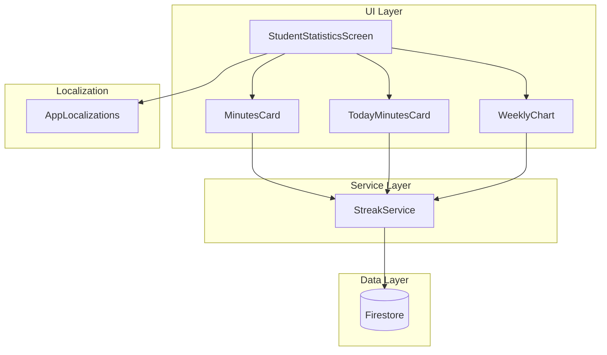
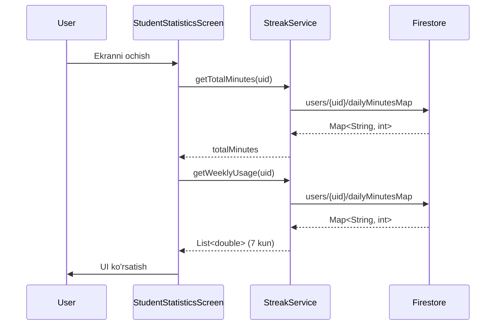

# Design Document

## Overview

Bu dizayn hujjati statistika ekranida o'qish vaqtini (daqiqalarni) ko'rsatish funksiyasini tavsiflaydi. Mavjud `StudentStatisticsScreen` ekraniga yangi UI komponentlari qo'shiladi va `StreakService`dagi mavjud `dailyMinutesMap` ma'lumotlaridan foydalaniladi.

### Asosiy Maqsadlar

1. **Umumiy o'qish vaqti** - Foydalanuvchining barcha vaqt davomida o'qishga sarflagan vaqtini ko'rsatish
2. **Bugungi o'qish vaqti** - Bugungi kun uchun o'qish vaqtini alohida ko'rsatish
3. **Haftalik grafik** - So'nggi 7 kunlik o'qish vaqtini vizual ko'rsatish
4. **Lokalizatsiya** - Barcha matnlarni o'zbek tilida ko'rsatish

### Texnik Yondashuv

- Mavjud `StreakService` xizmatidan foydalanish (`dailyMinutesMap`, `getWeeklyUsage`)
- `GamifiedCard` widgetidan foydalanib yangi statistika kartalari yaratish
- `AppLocalizations`ga yangi lokalizatsiya stringlari qo'shish
- Dark/Light mode qo'llab-quvvatlash

## Architecture

### Komponent Diagrammasi



### Ma'lumot Oqimi



## Components and Interfaces

### 1. StreakService Kengaytmalari

`StreakService`ga yangi metodlar qo'shiladi:

```dart
/// StreakService kengaytmalari
class StreakService {
  // Mavjud metodlar...
  
  /// Umumiy o'qish daqiqalarini olish
  /// @param uid - Foydalanuvchi ID
  /// @returns Umumiy daqiqalar soni
  static Future<int> getTotalMinutes(String uid) async {
    try {
      final doc = await _firestore.collection('users').doc(uid).get();
      if (doc.exists) {
        final dailyMinutesMap = doc.data()?['dailyMinutesMap'] as Map<String, dynamic>? ?? {};
        int total = 0;
        for (final value in dailyMinutesMap.values) {
          total += (value as int?) ?? 0;
        }
        return total;
      }
    } catch (e) {
      // Xatolikni log qilish
    }
    return 0;
  }
  
  /// Bugungi o'qish daqiqalarini olish
  /// @param uid - Foydalanuvchi ID
  /// @returns Bugungi daqiqalar soni
  static Future<int> getTodayMinutes(String uid) async {
    try {
      final doc = await _firestore.collection('users').doc(uid).get();
      if (doc.exists) {
        final dailyMinutesMap = doc.data()?['dailyMinutesMap'] as Map<String, dynamic>? ?? {};
        final today = _getDateKey(DateTime.now());
        return (dailyMinutesMap[today] as int?) ?? 0;
      }
    } catch (e) {
      // Xatolikni log qilish
    }
    return 0;
  }
}
```

### 2. Vaqt Formatlash Utility

Yangi utility funksiya vaqtni formatlash uchun:

```dart
/// Daqiqalarni o'qilishi oson formatga o'girish
/// @param minutes - Daqiqalar soni
/// @param l - AppLocalizations instance
/// @returns Formatlangan string (masalan: "2 soat 30 daqiqa" yoki "45 daqiqa")
String formatMinutes(int minutes, AppLocalizations l) {
  if (minutes < 60) {
    return l.minutesFormat(minutes);
  }
  final hours = minutes ~/ 60;
  final remainingMinutes = minutes % 60;
  if (remainingMinutes == 0) {
    return l.hoursFormat(hours);
  }
  return l.hoursMinutesFormat(hours, remainingMinutes);
}
```

### 3. StudentStatisticsScreen Yangilanishlari

#### Yangi State O'zgaruvchilari

```dart
class _StudentStatisticsScreenState extends State<StudentStatisticsScreen> {
  // Mavjud o'zgaruvchilar...
  
  int _totalMinutes = 0;      // Umumiy o'qish daqiqalari
  int _todayMinutes = 0;      // Bugungi o'qish daqiqalari
  List<double> _weeklyMinutes = List.filled(7, 0.0);  // Haftalik ma'lumotlar
  List<String> _weeklyDates = [];  // Haftalik sanalar
}
```

#### Yangi UI Komponentlari

**Vaqt Statistika Kartalari (Mavjud kartalar qatoriga qo'shiladi):**

```dart
Row(
  children: [
    Expanded(
      child: _buildStatCard(
        icon: '⏱️',
        title: l.studyTime,
        value: formatMinutes(_totalMinutes, l),
        color: AppColors.duoPurple,
        isDark: isDark,
      ),
    ),
    const SizedBox(width: 12),
    Expanded(
      child: _buildStatCard(
        icon: '📅',
        title: l.today,
        value: formatMinutes(_todayMinutes, l),
        color: AppColors.duoBlue,
        isDark: isDark,
      ),
    ),
  ],
),
```

**Haftalik Grafik Komponenti:**

```dart
Widget _buildWeeklyChart({
  required bool isDark,
  required AppLocalizations l,
}) {
  final maxValue = _weeklyMinutes.reduce((a, b) => a > b ? a : b);
  final hasData = maxValue > 0;
  
  return GamifiedCard(
    padding: const EdgeInsets.all(20),
    color: isDark ? AppColors.duoCardGray.withValues(alpha: 0.05) : Colors.white,
    shadowColor: isDark ? Colors.black26 : AppColors.duoCardGrayShadow,
    child: Column(
      crossAxisAlignment: CrossAxisAlignment.start,
      children: [
        Text(
          l.weeklyStatistics,
          style: TextStyle(
            fontSize: 16,
            fontWeight: FontWeight.w800,
            color: isDark ? Colors.white : AppColors.duoTextDark,
          ),
        ),
        const SizedBox(height: 16),
        if (!hasData)
          Center(
            child: Text(
              l.noStudyTimeRecorded,
              style: TextStyle(
                fontSize: 14,
                color: isDark ? Colors.white54 : AppColors.duoTextLight,
              ),
            ),
          )
        else
          SizedBox(
            height: 120,
            child: Row(
              mainAxisAlignment: MainAxisAlignment.spaceEvenly,
              crossAxisAlignment: CrossAxisAlignment.end,
              children: List.generate(7, (index) {
                final value = _weeklyMinutes[index];
                final height = maxValue > 0 ? (value / maxValue) * 80 : 0.0;
                return _buildChartBar(
                  date: _weeklyDates[index],
                  value: value.toInt(),
                  height: height,
                  isDark: isDark,
                );
              }),
            ),
          ),
      ],
    ),
  );
}

Widget _buildChartBar({
  required String date,
  required int value,
  required double height,
  required bool isDark,
}) {
  return Column(
    mainAxisAlignment: MainAxisAlignment.end,
    children: [
      Text(
        '$value',
        style: TextStyle(
          fontSize: 10,
          fontWeight: FontWeight.w600,
          color: isDark ? Colors.white70 : AppColors.duoTextLight,
        ),
      ),
      const SizedBox(height: 4),
      Container(
        width: 32,
        height: height.clamp(4.0, 80.0),
        decoration: BoxDecoration(
          color: AppColors.duoGreen,
          borderRadius: BorderRadius.circular(4),
        ),
      ),
      const SizedBox(height: 4),
      Text(
        date,
        style: TextStyle(
          fontSize: 10,
          fontWeight: FontWeight.w600,
          color: isDark ? Colors.white54 : AppColors.duoTextLight,
        ),
      ),
    ],
  );
}
```

### 4. AppLocalizations Yangilanishlari

Yangi lokalizatsiya stringlari:

```dart
// ── Study Time Statistics ────────────────────────────────────────────────────
String get studyTime => _t({
  'uz': "O'qish vaqti",
  'kaa': "Oqıw waqtı",
  'ru': "Время учёбы",
  'de': "Lernzeit",
});

String get today => _t({
  'uz': "Bugun",
  'kaa': "Búgin",
  'ru': "Сегодня",
  'de': "Heute",
});

String get weeklyStatistics => _t({
  'uz': "Haftalik statistika",
  'kaa': "Aptasına statistika",
  'ru': "Недельная статистика",
  'de': "Wochenstatistik",
});

String get noStudyTimeRecorded => _t({
  'uz': "Hali o'qish vaqti yozilmagan",
  'kaa': "Ele oqıw waqtı jazılmaǵan",
  'ru': "Время учёбы ещё не записано",
  'de': "Noch keine Lernzeit erfasst",
});

String get minute => _t({
  'uz': "daqiqa",
  'kaa': "minut",
  'ru': "минута",
  'de': "Minute",
});

String get minutes => _t({
  'uz': "daqiqa",
  'kaa': "minut",
  'ru': "минут",
  'de': "Minuten",
});

String get hour => _t({
  'uz': "soat",
  'kaa': "saat",
  'ru': "час",
  'de': "Stunde",
});

String get hours => _t({
  'uz': "soat",
  'kaa': "saat",
  'ru': "часов",
  'de': "Stunden",
});

String minutesFormat(int minutes) => _t({
  'uz': "$minutes daqiqa",
  'kaa': "$minutes minut",
  'ru': "$minutes мин",
  'de': "$minutes Min",
});

String hoursFormat(int hours) => _t({
  'uz': "$hours soat",
  'kaa': "$hours saat",
  'ru': "$hours ч",
  'de': "$hours Std",
});

String hoursMinutesFormat(int hours, int minutes) => _t({
  'uz': "$hours soat $minutes daqiqa",
  'kaa': "$hours saat $minutes minut",
  'ru': "$hours ч $minutes мин",
  'de': "$hours Std $minutes Min",
});
```

## Data Models

### Firestore Ma'lumot Strukturasi

Mavjud `users` kolleksiyasidagi hujjat strukturasi:

```typescript
interface UserDocument {
  // Mavjud maydonlar...
  uid: string;
  name: string;
  email: string;
  totalStars: number;
  currentStreak: number;
  lastActiveDate: string;  // "YYYY-MM-DD" format
  activityLog: string[];   // ["2024-01-15", "2024-01-16", ...]
  
  // O'qish vaqti ma'lumotlari (mavjud)
  dailyMinutesMap: {
    [date: string]: number;  // "2024-01-15": 45
  };
}
```

### Lokal State Modellari

```dart
/// Haftalik statistika ma'lumotlari
class WeeklyStats {
  final List<double> minutes;  // 7 kunlik daqiqalar
  final List<String> dates;    // 7 kunlik sanalar ("15.1", "16.1", ...)
  final int totalMinutes;      // Haftalik umumiy
  
  WeeklyStats({
    required this.minutes,
    required this.dates,
    required this.totalMinutes,
  });
  
  bool get hasData => minutes.any((m) => m > 0);
  double get maxValue => minutes.reduce((a, b) => a > b ? a : b);
}
```

## Correctness Properties

*A property is a characteristic or behavior that should hold true across all valid executions of a system-essentially, a formal statement about what the system should do. Properties serve as the bridge between human-readable specifications and machine-verifiable correctness guarantees.*

### Property 1: Vaqt Formatlash To'g'riligi

*For any* daqiqa qiymati (0 dan cheksizgacha), formatlash funksiyasi quyidagi qoidalarga amal qilishi kerak:
- Agar daqiqa < 60 bo'lsa, natija faqat daqiqalarni o'z ichiga olishi kerak
- Agar daqiqa >= 60 bo'lsa, natija soat va daqiqalarni o'z ichiga olishi kerak
- Formatlangan string hech qachon bo'sh bo'lmasligi kerak

**Validates: Requirements 1.2, 1.3**

### Property 2: Umumiy Daqiqalar Hisoblash To'g'riligi

*For any* valid `dailyMinutesMap` (har bir qiymat >= 0), umumiy daqiqalar hisoblash funksiyasi barcha qiymatlarning yig'indisiga teng bo'lishi kerak:
- `getTotalMinutes(map) == sum(map.values)`
- Bo'sh map uchun natija 0 bo'lishi kerak
- Manfiy qiymatlar bo'lmasligi kerak

**Validates: Requirements 4.2**

### Property 3: Proporsional Ustun Balandligi

*For any* haftalik ma'lumotlar to'plami (7 ta qiymat), grafik ustunlari quyidagi qoidalarga amal qilishi kerak:
- Eng yuqori qiymatli ustun maksimal balandlikda bo'lishi kerak
- Boshqa ustunlar maksimal qiymatga nisbatan proporsional balandlikda bo'lishi kerak
- Barcha qiymatlar 0 bo'lsa, barcha ustunlar minimal balandlikda bo'lishi kerak
- `height[i] / maxHeight == value[i] / maxValue` (maxValue > 0 bo'lganda)

**Validates: Requirements 3.3**

## Error Handling

### Xatolik Holatlari va Qayta Ishlash

| Xatolik Turi | Sabab | Qayta Ishlash |
|--------------|-------|---------------|
| Firestore Connection Error | Tarmoq muammosi | 0 qiymatlarni ko'rsatish, xatolik logga yozish |
| Invalid Data Format | Noto'g'ri ma'lumot strukturasi | Default qiymatlarni ishlatish |
| Null User ID | Foydalanuvchi tizimga kirmagan | Ekranni ko'rsatmaslik, login sahifasiga yo'naltirish |
| Empty dailyMinutesMap | Yangi foydalanuvchi | 0 qiymatlarni ko'rsatish, bo'sh holat xabarini ko'rsatish |

### Xatolik Qayta Ishlash Kodi

```dart
Future<void> _loadMinutesData() async {
  try {
    final userProvider = Provider.of<UserProvider>(context, listen: false);
    final uid = userProvider.uid;
    
    if (uid.isEmpty) {
      // Foydalanuvchi tizimga kirmagan
      return;
    }
    
    final totalMinutes = await StreakService.getTotalMinutes(uid);
    final todayMinutes = await StreakService.getTodayMinutes(uid);
    final weeklyMinutes = await StreakService.getWeeklyUsage(uid);
    final weeklyDates = await StreakService.getWeeklyDates();
    
    if (mounted) {
      setState(() {
        _totalMinutes = totalMinutes;
        _todayMinutes = todayMinutes;
        _weeklyMinutes = weeklyMinutes;
        _weeklyDates = weeklyDates;
      });
    }
  } catch (e) {
    // Xatolikni log qilish
    debugPrint('Error loading minutes data: $e');
    
    // Default qiymatlarni o'rnatish
    if (mounted) {
      setState(() {
        _totalMinutes = 0;
        _todayMinutes = 0;
        _weeklyMinutes = List.filled(7, 0.0);
        _weeklyDates = [];
      });
    }
  }
}
```

## Testing Strategy

### Unit Testlar

1. **Vaqt Formatlash Testlari**
   - 0 daqiqa → "0 daqiqa"
   - 45 daqiqa → "45 daqiqa"
   - 60 daqiqa → "1 soat"
   - 90 daqiqa → "1 soat 30 daqiqa"
   - 120 daqiqa → "2 soat"

2. **Umumiy Daqiqalar Hisoblash Testlari**
   - Bo'sh map → 0
   - Bitta qiymat → shu qiymat
   - Ko'p qiymatlar → yig'indi

3. **Proporsional Balandlik Testlari**
   - Barcha 0 → barcha minimal
   - Bitta maksimal → shu ustun to'liq balandlikda
   - Turli qiymatlar → proporsional balandliklar

### Property-Based Testlar

**Test Configuration:**
- Minimum 100 iterations per property test
- Use `flutter_test` with `property_test` package

```dart
// Feature: statistics-minutes-display, Property 1: Vaqt Formatlash To'g'riligi
test('formatMinutes should correctly format any minute value', () {
  // Property: For any minutes >= 0, format should follow rules
  forAll(integers(min: 0, max: 10000), (minutes) {
    final result = formatMinutes(minutes, mockLocalizations);
    
    expect(result.isNotEmpty, isTrue);
    
    if (minutes < 60) {
      expect(result.contains('soat'), isFalse);
    } else {
      expect(result.contains('soat'), isTrue);
    }
  });
});

// Feature: statistics-minutes-display, Property 2: Umumiy Daqiqalar Hisoblash
test('getTotalMinutes should equal sum of all values', () {
  // Property: For any valid map, total = sum(values)
  forAll(maps(strings(), integers(min: 0, max: 1000)), (map) {
    final expected = map.values.fold(0, (a, b) => a + b);
    final result = calculateTotalMinutes(map);
    
    expect(result, equals(expected));
  });
});

// Feature: statistics-minutes-display, Property 3: Proporsional Ustun Balandligi
test('chart bar heights should be proportional to values', () {
  // Property: height[i] / maxHeight == value[i] / maxValue
  forAll(lists(doubles(min: 0, max: 1000), minLength: 7, maxLength: 7), (values) {
    final maxValue = values.reduce((a, b) => a > b ? a : b);
    final heights = calculateBarHeights(values, maxHeight: 80);
    
    if (maxValue > 0) {
      for (int i = 0; i < 7; i++) {
        final expectedRatio = values[i] / maxValue;
        final actualRatio = heights[i] / 80;
        expect(actualRatio, closeTo(expectedRatio, 0.01));
      }
    } else {
      // All zeros case
      expect(heights.every((h) => h == 4.0), isTrue); // minimum height
    }
  });
});
```

### Widget Testlar

1. **MinutesCard Widget Test**
   - ⏱️ emoji ko'rsatilishi
   - "O'qish vaqti" sarlavhasi
   - Formatlangan vaqt qiymati

2. **TodayMinutesCard Widget Test**
   - 📅 emoji ko'rsatilishi
   - "Bugun" sarlavhasi
   - Bugungi vaqt qiymati

3. **WeeklyChart Widget Test**
   - 7 ta ustun ko'rsatilishi
   - Sanalar ko'rsatilishi
   - Bo'sh holat xabari (barcha 0 bo'lganda)

### Integration Testlar

1. **Firestore Integration**
   - Ma'lumotlar to'g'ri yuklanishi
   - Xatolik holatida graceful degradation

2. **Lokalizatsiya Integration**
   - O'zbek tilida to'g'ri ko'rsatish
   - Til o'zgartirilganda yangilanish

3. **Theme Integration**
   - Dark mode da to'g'ri ranglar
   - Light mode da to'g'ri ranglar
