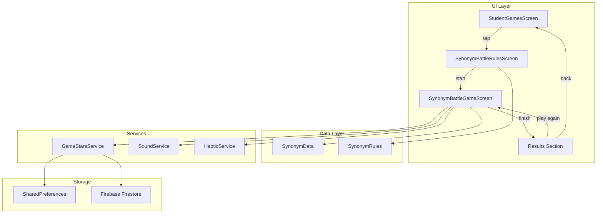
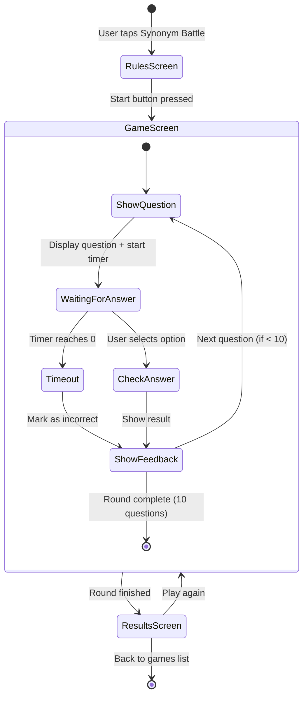

# Technical Design Document: Sinonimlar Jangi (Synonym Battle Game)

## Overview

Sinonimlar Jangi - bu nemis tilini o'rganuvchilar uchun interaktiv o'yin bo'lib, foydalanuvchilar nemis so'zlariga to'g'ri sinonimlarni tanlash orqali lug'at boyligini oshiradilar. O'yin mavjud o'yinlar (Der/Die/Das, Grammar Quiz, Strange Sentences) bilan bir xil arxitektura va UI patternlaridan foydalanadi.

### Asosiy Xususiyatlar
- **Qoidalar Ekrani**: O'yin qoidalarini o'zbek tilida tushuntiradi
- **O'yin Ekrani**: 10 ta savoldan iborat raund, har bir savol uchun 10 soniya vaqt
- **Natijalar Ekrani**: Raund statistikasi va motivatsion xabarlar
- **Ball Tizimi**: To'g'ri javoblar uchun 10 ball, ketma-ket 5 ta to'g'ri javob uchun +5 bonus
- **Yulduz Saqlash**: GameStarsService orqali local storage va Firestore ga sinxronizatsiya

### Texnologiyalar
- **Framework**: Flutter
- **State Management**: StatefulWidget (mavjud patternlarga mos)
- **Storage**: SharedPreferences (local), Firebase Firestore (cloud)
- **Audio**: audioplayers package (SoundService)
- **Haptics**: Flutter HapticFeedback (HapticService)

## Architecture

### Umumiy Arxitektura Diagrammasi



### O'yin Oqimi (Game Flow)



## Components and Interfaces

### 1. SynonymData (lib/utils/synonym_data.dart)

Sinonim ma'lumotlarini saqlash va boshqarish uchun utility class.

```dart
/// Sinonim so'z ma'lumotlari modeli
class SynonymWord {
  final String word;           // Nemis so'zi (masalan: "schnell")
  final String translation;    // O'zbek tarjimasi (masalan: "tez")
  final List<String> synonyms; // To'g'ri sinonimlar ro'yxati
  final String difficulty;     // Qiyinlik: "easy", "medium", "hard"
  
  const SynonymWord({
    required this.word,
    required this.translation,
    required this.synonyms,
    required this.difficulty,
  });
}

/// Sinonim ma'lumotlari utility class
class SynonymData {
  /// Barcha sinonim so'zlar ro'yxati
  static const List<SynonymWord> allWords = [...];
  
  /// Jami so'zlar soni
  static int get totalWords => allWords.length;
  
  /// Tasodifiy aralashtrilgan so'zlar olish
  static List<SynonymWord> shuffledWords({int limit = 10});
  
  /// Noto'g'ri variantlar generatsiya qilish
  static List<String> generateDistractors(SynonymWord word, int count);
  
  /// Savol variantlarini yaratish (1 to'g'ri + 3 noto'g'ri)
  static List<String> generateOptions(SynonymWord word);
}
```

### 2. SynonymRules (lib/utils/synonym_rules.dart)

O'yin qoidalari va konfiguratsiyasi.

```dart
/// Sinonimlar Jangi o'yin qoidalari
class SynonymRules {
  /// O'yin sarlavhasi
  static const String gameTitle = 'Sinonimlar Jangi';
  
  /// Har bir raund uchun savollar soni
  static const int questionsPerRound = 10;
  
  /// Har bir savol uchun vaqt (soniyalarda)
  static const int secondsPerQuestion = 10;
  
  /// To'g'ri javob uchun ball
  static const int pointsPerCorrect = 10;
  
  /// Streak bonus har nechta to'g'ri javobda beriladi
  static const int streakBonusEvery = 5;
  
  /// Streak bonus miqdori
  static const int streakBonusPoints = 5;
  
  /// Qizil timer chegarasi (soniyalarda)
  static const int timerWarningThreshold = 4;
  
  /// Qoidalar matni
  static const String howToPlayTitle = 'QANDAY O\'YNALADI?';
  static const String howToPlayText = '''
Ekranda nemis so'zi va uning o'zbek tarjimasi ko'rsatiladi.
Sizning vazifangiz - to'rtta variant orasidan to'g'ri sinonimni topish.
Har bir savol uchun 10 soniya vaqtingiz bor.
  ''';
  
  /// Ball tizimi matni
  static const String scoringTitle = 'BALL TIZIMI';
  static const String scoringText = '''
• Har bir to'g'ri javob: +10 ⭐
• Ketma-ket 5 ta to'g'ri javob: +5 bonus ⭐
• Noto'g'ri javob yoki vaqt tugashi: 0 ball
  ''';
}
```

### 3. SynonymBattleRulesScreen (lib/screens/student/games/synonym_battle_rules_screen.dart)

Qoidalar ekrani - mavjud DerDieDasRulesScreen patterniga mos.

```dart
class SynonymBattleRulesScreen extends StatelessWidget {
  const SynonymBattleRulesScreen({super.key});
  
  @override
  Widget build(BuildContext context) {
    // ThemeManager.isDark orqali dark/light mode
    // GamifiedCard widgetlaridan foydalanish
    // SynonymRules dan matnlarni olish
    // "O'YINNI BOSHLASH" tugmasi -> SynonymBattleGameScreen
  }
}
```

### 4. SynonymBattleGameScreen (lib/screens/student/games/synonym_battle_game_screen.dart)

Asosiy o'yin ekrani - mavjud DerDieDasGameScreen patterniga mos.

```dart
class SynonymBattleGameScreen extends StatefulWidget {
  const SynonymBattleGameScreen({super.key});
  
  @override
  State<SynonymBattleGameScreen> createState() => _SynonymBattleGameScreenState();
}

class _SynonymBattleGameScreenState extends State<SynonymBattleGameScreen> {
  // State variables
  late List<SynonymWord> _deck;
  late List<String> _currentOptions;
  int _index = 0;
  int _score = 0;
  int _correct = 0;
  int _wrong = 0;
  int _streak = 0;
  int _timeLeft = SynonymRules.secondsPerQuestion;
  Timer? _timer;
  bool _answered = false;
  bool _finished = false;
  String? _feedbackMessage;
  bool? _lastWasCorrect;
  int _totalSavedStars = 0;
  
  // Methods
  void _startNewRound();
  void _startTimer();
  void _onAnswer(String? chosenSynonym);
  void _nextQuestion();
  Future<void> _finishRound();
  
  // Build methods
  Widget _buildGame(bool isDark);
  Widget _buildResults(bool isDark);
  Widget _buildOptionButton(String option, bool isDark);
}
```

### 5. GameStarsService Extension

Mavjud GameStarsService ga sinonim o'yini uchun metodlar qo'shish.

```dart
// lib/services/game_stars_service.dart ga qo'shiladi

class GameStarsService {
  // Mavjud metodlar...
  
  /// Sinonim o'yini uchun key
  static String _synonymBattleKey(String uid) => 'game_stars_synonym_battle_$uid';
  
  /// Sinonim o'yini yulduzlarini olish
  static Future<int> getSynonymBattleStars(String uid) async {
    final prefs = await SharedPreferences.getInstance();
    return prefs.getInt(_synonymBattleKey(uid)) ?? 0;
  }
  
  /// Sinonim o'yini yulduzlarini qo'shish
  static Future<int> addSynonymBattleStars(String uid, int earned) async {
    if (earned <= 0) return getSynonymBattleStars(uid);
    final prefs = await SharedPreferences.getInstance();
    final key = _synonymBattleKey(uid);
    final total = (prefs.getInt(key) ?? 0) + earned;
    await prefs.setInt(key, total);
    await _syncStarsToFirestore(uid);
    return total;
  }
  
  /// Jami yulduzlarni hisoblash (yangilangan)
  static Future<int> getTotalStars(String uid) async {
    final der = await getDerDieDasStars(uid);
    final strange = await getStrangeSentencesStars(uid);
    final grammar = await getGrammarGameStars(uid);
    final synonym = await getSynonymBattleStars(uid); // Yangi
    return der + strange + grammar + synonym;
  }
}
```

### 6. StudentGamesScreen Integration

Mavjud StudentGamesScreen da "Coming Soon" ni haqiqiy o'yinga almashtirish.

```dart
// _showComingSoonDialog() o'rniga _openSynonymBattleGame() chaqirish

Future<void> _openSynonymBattleGame() async {
  await HapticService.mediumImpact();
  if (!mounted) return;
  final allowed = await GroupCheckHelper.checkAndWarn(context);
  if (!allowed || !mounted) return;
  await Navigator.push(
    context, 
    SlideTransitionPage(child: const SynonymBattleRulesScreen()),
  );
  if (mounted) await _loadStars();
}
```

## Data Models

### SynonymWord Model

```dart
/// Sinonim so'z ma'lumotlari
class SynonymWord {
  /// Nemis so'zi
  final String word;
  
  /// O'zbek tilidagi tarjima
  final String translation;
  
  /// To'g'ri sinonimlar ro'yxati (kamida 1 ta)
  final List<String> synonyms;
  
  /// Qiyinlik darajasi: "easy", "medium", "hard"
  final String difficulty;
  
  const SynonymWord({
    required this.word,
    required this.translation,
    required this.synonyms,
    required this.difficulty,
  });
  
  /// Tasodifiy sinonim olish
  String get randomSynonym => synonyms[Random().nextInt(synonyms.length)];
}
```

### Sinonim Ma'lumotlari Strukturasi

```dart
// lib/utils/synonym_data.dart

static const List<SynonymWord> allWords = [
  // ===== OSON (Easy) - 20 ta =====
  SynonymWord(
    word: 'schnell',
    translation: 'tez',
    synonyms: ['rasch', 'flink', 'zügig'],
    difficulty: 'easy',
  ),
  SynonymWord(
    word: 'groß',
    translation: 'katta',
    synonyms: ['riesig', 'gewaltig', 'enorm'],
    difficulty: 'easy',
  ),
  SynonymWord(
    word: 'klein',
    translation: 'kichik',
    synonyms: ['winzig', 'gering', 'minimal'],
    difficulty: 'easy',
  ),
  // ... davomi
  
  // ===== O'RTA (Medium) - 20 ta =====
  SynonymWord(
    word: 'verstehen',
    translation: 'tushunmoq',
    synonyms: ['begreifen', 'kapieren', 'erfassen'],
    difficulty: 'medium',
  ),
  // ... davomi
  
  // ===== QIYIN (Hard) - 15 ta =====
  SynonymWord(
    word: 'beeindruckend',
    translation: 'ta\'sirli',
    synonyms: ['imposant', 'eindrucksvoll', 'überwältigend'],
    difficulty: 'hard',
  ),
  // ... davomi
];
```

### Noto'g'ri Variantlar Generatsiyasi

```dart
/// Noto'g'ri variantlar (distractors) generatsiya qilish
static List<String> generateDistractors(SynonymWord word, int count) {
  // Barcha so'zlardan sinonimlarni yig'ish (joriy so'znikidan tashqari)
  final allSynonyms = <String>[];
  for (final w in allWords) {
    if (w.word != word.word) {
      allSynonyms.addAll(w.synonyms);
    }
  }
  
  // Tasodifiy aralashtirish va kerakli miqdorni olish
  allSynonyms.shuffle();
  return allSynonyms.take(count).toList();
}

/// Savol uchun 4 ta variant yaratish
static List<String> generateOptions(SynonymWord word) {
  final correctSynonym = word.randomSynonym;
  final distractors = generateDistractors(word, 3);
  
  final options = [correctSynonym, ...distractors];
  options.shuffle();
  
  return options;
}
```

## Correctness Properties

*A property is a characteristic or behavior that should hold true across all valid executions of a system-essentially, a formal statement about what the system should do. Properties serve as the bridge between human-readable specifications and machine-verifiable correctness guarantees.*

### Property 1: Data Integrity - Synonyms Exist

*For any* word in the SynonymData.allWords list, the word must have at least one valid synonym in its synonyms list.

**Validates: Requirements 2.2**

### Property 2: Data Integrity - Translations Exist

*For any* word in the SynonymData.allWords list, the word must have a non-empty Uzbek translation.

**Validates: Requirements 2.3**

### Property 3: Question Generation Validity

*For any* SynonymWord, when generateOptions is called, the result must contain exactly 4 options, exactly one of which is a valid synonym of the word, and the options must be in a randomized order (not always in the same position).

**Validates: Requirements 3.3, 3.4, 3.5**

### Property 4: Answer Validation Correctness

*For any* answer selection, the system correctly identifies whether the selected option is a valid synonym of the current word (returns true if and only if the selection is in the word's synonyms list).

**Validates: Requirements 4.1**

### Property 5: Scoring - Base Points

*For any* correct answer, the score must increase by exactly SynonymRules.pointsPerCorrect (10 points).

**Validates: Requirements 6.1**

### Property 6: Scoring - Streak Bonus

*For any* streak count that is a positive multiple of SynonymRules.streakBonusEvery (5), the system must award an additional SynonymRules.streakBonusPoints (5 points) bonus.

**Validates: Requirements 6.2**

### Property 7: Scoring - Streak Reset

*For any* incorrect answer (including timeout), the streak counter must reset to exactly 0.

**Validates: Requirements 6.5**

### Property 8: Results Calculation and Display

*For any* combination of correct and total answers, the accuracy percentage must equal (correct / total) * 100, and the displayed emoji/message must match the accuracy thresholds: 90%+ = 🏆, 70%+ = ⭐, 50%+ = 💪, <50% = 📘.

**Validates: Requirements 8.3, 8.4**

### Property 9: Shuffle Produces Valid Permutation

*For any* word list, calling shuffledWords must return a permutation of the original list containing all the same words (no duplicates, no missing words).

**Validates: Requirements 2.5**

## Error Handling

### Timer Timeout
- **Scenario**: Foydalanuvchi vaqt ichida javob bermasa
- **Handling**: Javob noto'g'ri deb hisoblanadi, to'g'ri javob ko'rsatiladi, streak 0 ga qaytadi
- **UI Feedback**: "Vaqt tugadi! To'g'ri: [sinonim]" xabari qizil rangda

### Empty Data
- **Scenario**: SynonymData.allWords bo'sh bo'lsa
- **Handling**: O'yin boshlanmaydi, xato xabari ko'rsatiladi
- **Prevention**: Compile-time const data bilan bu holat yuz bermaydi

### Network Errors (Firestore Sync)
- **Scenario**: Firestore ga yulduzlarni saqlashda xato
- **Handling**: Local storage ishlaydi, xato ignore qilinadi
- **User Impact**: Foydalanuvchi hech narsa sezmaydi, keyingi ulanishda sinxronizatsiya

### Invalid State
- **Scenario**: _current null bo'lsa (deck tugagan)
- **Handling**: CircularProgressIndicator ko'rsatiladi, keyin results ekraniga o'tiladi

## Testing Strategy

### Unit Tests

**Data Validation Tests:**
- SynonymData.allWords kamida 50 ta so'z o'z ichiga olishini tekshirish
- Har bir so'zda kamida 1 ta sinonim borligini tekshirish
- Har bir so'zda translation borligini tekshirish
- Difficulty qiymatlari to'g'ri ekanligini tekshirish

**Game Logic Tests:**
- generateOptions 4 ta variant qaytarishini tekshirish
- generateOptions da faqat 1 ta to'g'ri javob borligini tekshirish
- Scoring logic to'g'ri ishlashini tekshirish
- Streak bonus to'g'ri hisoblanishini tekshirish
- Streak reset to'g'ri ishlashini tekshirish
- Accuracy calculation to'g'ri ekanligini tekshirish

**Timer Tests:**
- Timer 10 soniyadan boshlanishini tekshirish
- Timeout noto'g'ri javob sifatida hisoblanishini tekshirish

### Property-Based Tests

Property-based testlar uchun `fast_check` yoki `glados` package ishlatiladi.

**Test Configuration:**
- Minimum 100 iterations per property test
- Tag format: **Feature: synonym-battle-game, Property {number}: {property_text}**

```dart
// test/synonym_battle_property_test.dart

import 'package:glados/glados.dart';
import 'package:test/test.dart';

void main() {
  // Feature: synonym-battle-game, Property 1: Data integrity - synonyms exist
  Glados<int>().test('every word has at least one synonym', (index) {
    final wordIndex = index % SynonymData.allWords.length;
    final word = SynonymData.allWords[wordIndex];
    expect(word.synonyms, isNotEmpty);
  });
  
  // Feature: synonym-battle-game, Property 3: Question generation validity
  Glados<int>().test('generateOptions returns exactly 4 options with 1 correct', (index) {
    final wordIndex = index % SynonymData.allWords.length;
    final word = SynonymData.allWords[wordIndex];
    final options = SynonymData.generateOptions(word);
    
    expect(options.length, equals(4));
    
    final correctCount = options.where((o) => word.synonyms.contains(o)).length;
    expect(correctCount, equals(1));
  });
  
  // Feature: synonym-battle-game, Property 5: Scoring - base points
  Glados2<int, int>().test('correct answer adds exactly 10 points', (initialScore, _) {
    final score = initialScore.abs() % 1000; // Reasonable score range
    final newScore = score + SynonymRules.pointsPerCorrect;
    expect(newScore - score, equals(10));
  });
  
  // Feature: synonym-battle-game, Property 8: Results calculation
  Glados2<int, int>().test('accuracy calculation is correct', (correct, total) {
    final c = correct.abs() % 11; // 0-10 correct
    final t = (total.abs() % 10) + 1; // 1-10 total (avoid division by zero)
    final actualTotal = c > t ? c : t; // Ensure correct <= total
    final actualCorrect = c > actualTotal ? actualTotal : c;
    
    final accuracy = (actualCorrect / actualTotal * 100).round();
    
    String expectedEmoji;
    if (accuracy >= 90) {
      expectedEmoji = '🏆';
    } else if (accuracy >= 70) {
      expectedEmoji = '⭐';
    } else if (accuracy >= 50) {
      expectedEmoji = '💪';
    } else {
      expectedEmoji = '📘';
    }
    
    // Verify emoji matches threshold
    expect(accuracy >= 90 ? '🏆' : accuracy >= 70 ? '⭐' : accuracy >= 50 ? '💪' : '📘', equals(expectedEmoji));
  });
}
```

### Widget Tests

**Rules Screen Tests:**
- Qoidalar matni ko'rsatilishini tekshirish
- "O'YINNI BOSHLASH" tugmasi mavjudligini tekshirish
- Tugma bosilganda navigatsiya ishlashini tekshirish

**Game Screen Tests:**
- Savol ko'rsatilishini tekshirish
- 4 ta variant ko'rsatilishini tekshirish
- Timer ko'rsatilishini tekshirish
- Javob tanlanganda feedback ko'rsatilishini tekshirish
- Dark/Light mode to'g'ri ishlashini tekshirish

**Results Screen Tests:**
- Ball ko'rsatilishini tekshirish
- Statistika ko'rsatilishini tekshirish
- "YANA O'YNASH" tugmasi ishlashini tekshirish
- "ORQAGA" tugmasi ishlashini tekshirish

### Integration Tests

**Full Game Flow Test:**
1. StudentGamesScreen dan Sinonimlar Jangi ni tanlash
2. Rules Screen ko'rsatilishini tekshirish
3. O'yinni boshlash
4. 10 ta savolga javob berish
5. Results Screen ko'rsatilishini tekshirish
6. Yulduzlar saqlanganini tekshirish

**Star Persistence Test:**
1. O'yinni o'ynash va ball to'plash
2. Ilovani qayta ochish
3. Jami yulduzlar to'g'ri ko'rsatilishini tekshirish
